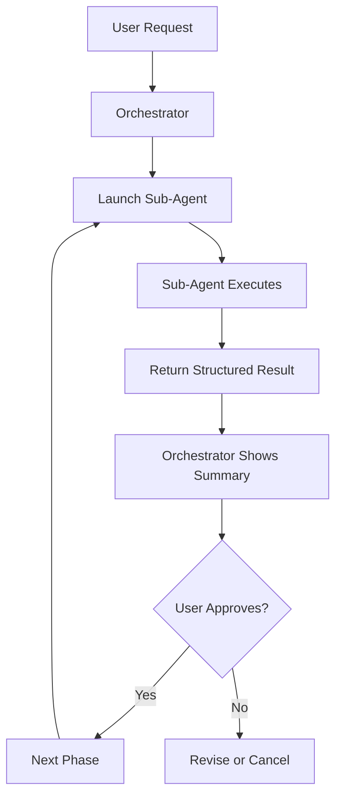

## Overview

Orchestrators in Agent Teams Lite are **delegate-only** coordinators. They never execute phase work directly — instead, they launch specialized sub-agents via the `Task` tool, track state, and present summaries to the user.

## Core Principle

```
Orchestrator = Lightweight State Machine
Sub-Agent = Full-Capability Worker
```

The orchestrator:
- ✅ Tracks which artifacts exist
- ✅ Launches sub-agents
- ✅ Presents summaries
- ✅ Asks for user approval
- ❌ Never reads source code directly
- ❌ Never writes implementation code
- ❌ Never writes specs/proposals/designs

Sub-agents:
- ✅ Read source code
- ✅ Write code
- ✅ Run tests
- ✅ Create artifacts
- ✅ Use any installed skills (TDD, React, TypeScript, etc.)

## Launching Sub-Agents

### The Task Tool

Orchestrators launch sub-agents using the `Task` tool with this pattern:

```javascript
Task(
  description: '{phase} for {change-name}',
  subagent_type: 'general',
  prompt: 'You are an SDD sub-agent. Read the skill file at ~/.config/opencode/skills/sdd-{phase}/SKILL.md FIRST, then follow its instructions exactly.

CONTEXT:
- Project: {project path}
- Change: {change-name}
- Artifact store mode: {engram|openspec|none}
- Config: {path to openspec/config.yaml}
- Previous artifacts: {list of paths to read}

TASK:
{specific task description}

Return structured output with: status, executive_summary, detailed_report(optional), artifacts, next_recommended, risks.'
)
```

### Real Example: Launching sdd-propose

```javascript
Task(
  description: 'Create proposal for add-dark-mode',
  subagent_type: 'general',
  prompt: 'You are an SDD sub-agent. Read the skill file at ~/.config/opencode/skills/sdd-propose/SKILL.md FIRST, then follow its instructions exactly.

CONTEXT:
- Project: /home/user/my-app
- Change: add-dark-mode
- Artifact store mode: engram
- Config: openspec/config.yaml
- Previous artifacts:
  - Exploration analysis from sdd-explore (observation ID: #1234)

TASK:
Create a change proposal based on the exploration analysis. The proposal should include:
- Intent (why this change is needed)
- Scope (in/out of scope)
- Approach (high-level strategy)
- Risks and rollback plan

Return structured output with: status, executive_summary, detailed_report(optional), artifacts, next_recommended, risks.'
)
```

## Prompt Structure

<ParamField path="description" type="string" required>
  Brief human-readable description of what this sub-agent will do.
  
  **Format**: `"{phase} for {change-name}"`
  
  **Examples**:
  - `"Explore codebase for CSV export feature"`
  - `"Create proposal for add-dark-mode"`
  - `"Implement Phase 1 tasks for authentication"`
</ParamField>

<ParamField path="subagent_type" type="string" default="general">
  Type of sub-agent to spawn. Currently only `"general"` is supported.
</ParamField>

<ParamField path="prompt" type="string" required>
  Full instructions for the sub-agent. Should follow this structure:
  
  1. **Skill Reference**: Tell the agent to read its SKILL.md file first
  2. **Context Block**: Provide project info, change name, mode, artifacts
  3. **Task Block**: Specific task description
  4. **Output Format**: Request structured return envelope
  
  See examples below.
</ParamField>

## Context Block Format

The context block provides essential information to the sub-agent:

```yaml
CONTEXT:
- Project: {absolute path to project root}
- Change: {change-name in kebab-case}
- Artifact store mode: {engram | openspec | none}
- Config: {path to config file, if using openspec}
- Previous artifacts: {dependencies from prior phases}
```

<ParamField path="Project" type="string" required>
  Absolute path to the project root directory.
  
  **Example**: `/home/user/my-app`
</ParamField>

<ParamField path="Change" type="string" required>
  Name of the change being worked on. Use kebab-case.
  
  **Example**: `add-dark-mode`, `fix-authentication-bug`
</ParamField>

<ParamField path="Artifact store mode" type="enum" required>
  Determines where artifacts are persisted.
  
  - `engram`: Memory-based persistence (recommended)
  - `openspec`: File-based artifacts in project
  - `none`: Ephemeral (no persistence)
  
  **Default resolution**:
  1. If Engram is available → use `engram`
  2. If user explicitly requests files → use `openspec`
  3. Otherwise → use `none`
</ParamField>

<ParamField path="Config" type="string">
  Path to project-specific config file (if using `openspec` mode).
  
  **Example**: `openspec/config.yaml`
</ParamField>

<ParamField path="Previous artifacts" type="array">
  List of artifacts from previous phases that this sub-agent needs to read.
  
  **For engram mode**: Include observation IDs
  
  **For openspec mode**: Include file paths
  
  **Example**:
  ```yaml
  Previous artifacts:
    - Proposal: openspec/changes/add-dark-mode/proposal.md
    - Specs: openspec/changes/add-dark-mode/specs/
    - Design: openspec/changes/add-dark-mode/design.md
  ```
</ParamField>

## Sub-Agent Response Format

Sub-agents return a structured envelope:

```typescript
interface SubAgentResponse {
  status: 'success' | 'failure' | 'blocked' | 'needs-review';
  executive_summary: string;  // One-paragraph summary
  detailed_report?: string;   // Optional detailed findings
  artifacts: Artifact[];      // Created/updated artifacts
  next_recommended: string;   // Suggested next command
  risks?: string[];           // Any blockers or concerns
}

interface Artifact {
  type: string;               // e.g., 'proposal', 'spec', 'design'
  location: string;           // File path or observation ID
  summary: string;            // Brief description
}
```

### Example Response

```markdown
## Proposal Created

**Change**: add-dark-mode
**Location**: openspec/changes/add-dark-mode/proposal.md

### Summary
- **Intent**: Enable dark mode support across the application to reduce eye strain
- **Scope**: 5 deliverables in, 3 items deferred
- **Approach**: Add theme context provider and CSS variable system
- **Risk Level**: Low

### Next Step
Ready for specs (sdd-spec) or design (sdd-design).
```

## Orchestrator Workflow

### Basic Flow



### Dependency Graph

The orchestrator follows this dependency graph:

```
proposal → specs ──→ tasks → apply → verify → archive
              ↕
           design
```

- `specs` and `design` can run in **parallel** (both depend only on `proposal`)
- `tasks` depends on **both** `specs` and `design`
- `verify` is optional but recommended before `archive`

## Example Workflows

### Fast-Forward (Create All Planning Artifacts)

When a user runs `/sdd-ff {change-name}`, the orchestrator launches phases sequentially:

```javascript
// Phase 1: Create proposal
Task(
  description: 'Create proposal for add-dark-mode',
  subagent_type: 'general',
  prompt: '...read sdd-propose/SKILL.md...'
)

// Phase 2 & 3: Create specs and design (parallel)
Task(
  description: 'Write specs for add-dark-mode',
  subagent_type: 'general',
  prompt: '...read sdd-spec/SKILL.md...'
)

Task(
  description: 'Create design for add-dark-mode',
  subagent_type: 'general',
  prompt: '...read sdd-design/SKILL.md...'
)

// Phase 4: Create tasks (depends on specs + design)
Task(
  description: 'Break down tasks for add-dark-mode',
  subagent_type: 'general',
  prompt: '...read sdd-tasks/SKILL.md...'
)
```

### Implementation with Batching

For large task lists, the orchestrator batches work:

```javascript
// Batch 1: Phase 1 tasks
Task(
  description: 'Implement Phase 1 tasks (1.1-1.3) for add-dark-mode',
  subagent_type: 'general',
  prompt: 'You are an SDD sub-agent. Read sdd-apply/SKILL.md FIRST.

CONTEXT:
- Project: /home/user/my-app
- Change: add-dark-mode
- Artifact store mode: engram

TASK:
Implement tasks 1.1 through 1.3 from Phase 1:
- 1.1 Create theme context provider
- 1.2 Add CSS variables for colors
- 1.3 Create theme toggle component

Follow TDD workflow if configured. Mark tasks complete in tasks.md as you go.'
)

// Show progress to user, then continue with next batch
```

## State Tracking

The orchestrator maintains minimal state between sub-agent calls:

```typescript
interface ChangeState {
  change_name: string;
  artifacts_created: {
    proposal: boolean;
    specs: boolean;
    design: boolean;
    tasks: boolean;
  };
  tasks_status?: {
    total: number;
    completed: number;
    current_phase: string;
  };
  blockers?: string[];
}
```

### Example State Tracking

```markdown
## Current State: add-dark-mode

**Artifacts Created**:
- ✅ Proposal (sdd/add-dark-mode/proposal)
- ✅ Specs (sdd/add-dark-mode/spec)
- ✅ Design (sdd/add-dark-mode/design)
- ✅ Tasks (sdd/add-dark-mode/tasks)

**Implementation Progress**:
- Phase 1: 3/3 complete ✅
- Phase 2: 0/5 pending

**Next Action**: Implement Phase 2 tasks or verify Phase 1
```

## Command Mapping

User commands map to orchestrator actions:

| Command | Action | Sub-Agents Launched |
|---------|--------|---------------------|
| `/sdd-init` | Initialize project | `sdd-init` |
| `/sdd-explore <topic>` | Explore codebase | `sdd-explore` |
| `/sdd-new <name>` | Start new change | `sdd-explore` → `sdd-propose` |
| `/sdd-ff [name]` | Fast-forward | `sdd-propose` → `sdd-spec` + `sdd-design` → `sdd-tasks` |
| `/sdd-apply [name]` | Implement tasks | `sdd-apply` (batched) |
| `/sdd-verify [name]` | Verify implementation | `sdd-verify` |
| `/sdd-archive [name]` | Archive change | `sdd-archive` |

## Best Practices

### 1. Keep Orchestrator Context Minimal

❌ **Don't** pass full file contents to sub-agents:
```javascript
prompt: 'Here is the entire 500-line design.md file:\n...'
```

✅ **Do** pass file paths/IDs:
```javascript
prompt: 'Previous artifacts:\n- Design: openspec/changes/add-dark-mode/design.md'
```

### 2. Always Show Summaries

After each sub-agent completes, show the user a summary and ask to proceed:

```markdown
## Proposal Created ✅

**Intent**: Add dark mode support
**Scope**: 5 features, 3 deferred
**Risk**: Low

**Next Step**: Create specs and design (parallel)

Continue? (yes/no)
```

### 3. Batch Large Task Lists

Don't send 50 tasks to one sub-agent. Break into phases:

```javascript
// Bad: Too many tasks
Task(prompt: 'Implement all 50 tasks from the change')

// Good: Batched by phase
Task(prompt: 'Implement Phase 1 tasks (1.1-1.5)')
// ...show progress, then...
Task(prompt: 'Implement Phase 2 tasks (2.1-2.4)')
```

### 4. Handle Blockers Gracefully

If a sub-agent reports a blocker, don't continue blindly:

```markdown
## Implementation Blocked ⚠️

**Task**: 2.3 Add authentication middleware
**Issue**: Missing JWT secret in environment variables

**What to do**:
1. Add JWT_SECRET to .env
2. Run /sdd-apply again to continue
```

### 5. Support All Persistence Modes

Always pass the artifact store mode to sub-agents:

```javascript
CONTEXT:
- Artifact store mode: engram
```

Sub-agents will adapt their behavior accordingly:
- `engram`: Persist to memory using Engram API
- `openspec`: Write files to `openspec/` directory
- `none`: Return results inline only

## Engram Integration

When using `engram` mode, artifacts follow this naming convention:

```yaml
title:     sdd/{change-name}/{artifact-type}
topic_key: sdd/{change-name}/{artifact-type}
type:      architecture
project:   {detected project name}
```

### Artifact Types

| Type | Produced By | Description |
|------|-------------|-------------|
| `explore` | sdd-explore | Exploration analysis |
| `proposal` | sdd-propose | Change proposal |
| `spec` | sdd-spec | Delta specifications |
| `design` | sdd-design | Technical design |
| `tasks` | sdd-tasks | Task breakdown |
| `apply-progress` | sdd-apply | Implementation progress |
| `verify-report` | sdd-verify | Verification report |
| `archive-report` | sdd-archive | Archive closure with lineage |

### Recovery Protocol

To retrieve artifacts from Engram, use this two-step process:

```javascript
// Step 1: Search by topic_key pattern
mem_search(
  query: "sdd/add-dark-mode/proposal",
  project: "my-app"
)
// Returns: truncated preview with observation ID

// Step 2: Get full content (REQUIRED)
mem_get_observation(id: observation_id_from_step_1)
// Returns: complete, untruncated content
```

<Warning>
  Never use `mem_search` results directly — they are truncated previews. Always call `mem_get_observation` to get full content.
</Warning>

## OpenSpec Integration

When using `openspec` mode, artifacts are written to the filesystem:

```
openspec/
├── config.yaml              # Project-specific SDD config
├── specs/                   # Source of truth specs
│   └── feature-name.md
└── changes/                 # Active changes
    ├── add-dark-mode/
    │   ├── proposal.md
    │   ├── specs/
    │   │   ├── ui.md
    │   │   └── api.md
    │   ├── design.md
    │   └── tasks.md
    └── archive/             # Completed changes
        └── add-csv-export/
```

## Related Resources

<Card title="SKILL.md Format" icon="file-code" href="/api/skill-format">
  Learn how to write skill files for sub-agents
</Card>

<Card title="Persistence Modes" icon="database" href="/guides/persistence">
  Understand engram, openspec, and none modes
</Card>

<Card title="Example Commands" icon="terminal" href="/commands/overview">
  See real orchestrator workflows in action
</Card>
