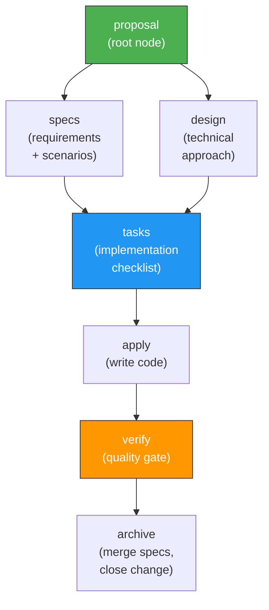

Agent Teams Lite uses a delegate-only orchestrator pattern where the main agent never does phase work directly. All execution happens in specialized sub-agents with fresh context.

## Architecture Overview

```
┌──────────────────────────────────────────────────────────┐
│  ORCHESTRATOR (your main agent — gentleman, default, etc) │
│                                                           │
│  Responsibilities:                                        │
│  • Detect when SDD is needed                              │
│  • Launch sub-agents via Task tool                        │
│  • Show summaries to user                                 │
│  • Ask for approval between phases                        │
│  • Track state: which artifacts exist, what's next        │
│                                                           │
│  Context usage: MINIMAL (only state + summaries)          │
└──────────────┬───────────────────────────────────────────┘
               │
               │ Task(subagent_type: 'general', prompt: 'Read skill...')
               │
    ┌──────────┴──────────────────────────────────────────┐
    │                                                      │
    ▼          ▼          ▼         ▼         ▼           ▼
┌────────┐┌────────┐┌────────┐┌────────┐┌────────┐┌────────┐
│EXPLORE ││PROPOSE ││  SPEC  ││ DESIGN ││ TASKS  ││ APPLY  │ ...
│        ││        ││        ││        ││        ││        │
│ Fresh  ││ Fresh  ││ Fresh  ││ Fresh  ││ Fresh  ││ Fresh  │
│context ││context ││context ││context ││context ││context │
└────────┘└────────┘└────────┘└────────┘└────────┘└────────┘
```

<Info>
**Key insight**: The orchestrator stays lightweight by delegating all work. Each sub-agent gets a fresh context window, reducing hallucinations and improving output quality.
</Info>

## The Dependency Graph

Agent Teams Lite phases follow a directed acyclic graph (DAG). Each phase has dependencies that must complete before it can run.



### Phase Dependencies

<Steps>

<Step title="Proposal (root)">
**Dependencies**: None

The **Proposer** sub-agent creates the root artifact with:
- Intent: Why this change?
- Scope: What's included and excluded?
- Approach: How will we build it?
- Rollback plan: What if things go wrong?

This anchors all downstream phases.
</Step>

<Step title="Specs and Design (parallel)">
**Dependencies**: Proposal

Once the proposal exists, two phases can run in parallel:

- **Spec Writer** creates delta specs (ADDED/MODIFIED/REMOVED requirements)
- **Designer** creates architecture decisions with rationale

These phases don't depend on each other, so they can execute concurrently for speed.
</Step>

<Step title="Tasks">
**Dependencies**: Specs + Design

The **Task Planner** reads both specs and design to create a phased, numbered task checklist:

```markdown
## Phase 1: Foundation
- 1.1 Create ThemeContext
- 1.2 Add CSS custom properties
- 1.3 Add localStorage persistence

## Phase 2: Components
- 2.1 Create ThemeToggle component
- 2.2 Add toggle to header
- 2.3 Wire up context provider
```

Tasks are small enough to complete in one session.
</Step>

<Step title="Apply (batched)">
**Dependencies**: Tasks

The **Implementer** sub-agent writes actual code following the specs and design. It works in batches (e.g., Phase 1 tasks, then Phase 2).

After each batch, it marks tasks complete and asks if you want to continue.

<Note>
v2.0 supports optional TDD workflow: write failing test → implement → refactor → repeat
</Note>
</Step>

<Step title="Verify">
**Dependencies**: Apply (all tasks complete)

The **Verifier** sub-agent validates the implementation:
- Runs your test suite (if configured)
- Compares implementation against every spec scenario
- Reports issues at CRITICAL/WARNING/SUGGESTION levels

<Note>
v2.0 includes a spec compliance matrix mapping each requirement to PASS/FAIL/SKIP
</Note>
</Step>

<Step title="Archive">
**Dependencies**: Verify (passed)

The **Archiver** sub-agent closes the change:
- Merges delta specs into main specs
- Moves the change folder to `archive/`
- Updates project context

The specs now reflect the new behavior, ready for the next change.
</Step>

</Steps>

## Sub-Agent Result Contract

Each sub-agent returns a structured JSON envelope to the orchestrator:

```json
{
  "status": "ok | warning | blocked | failed",
  "executive_summary": "short decision-grade summary",
  "detailed_report": "optional long-form analysis when needed",
  "artifacts": [
    {
      "name": "design",
      "store": "engram | openspec | none",
      "ref": "observation-id | file-path | null"
    }
  ],
  "next_recommended": ["tasks"],
  "risks": ["optional risk list"]
}
```

<CardGroup cols={2}>
  <Card title="executive_summary" icon="message">
    Short summary for the orchestrator to show the user. Always present.
  </Card>
  <Card title="detailed_report" icon="file-lines">
    Long-form analysis for complex architecture work. Optional.
  </Card>
  <Card title="artifacts" icon="box">
    List of artifacts created by this phase with storage location.
  </Card>
  <Card title="next_recommended" icon="arrow-right">
    Suggests which phases can run next based on the DAG.
  </Card>
</CardGroup>

The orchestrator reads `executive_summary` and shows it to the user. It stores `artifacts` references for dependency tracking. It uses `next_recommended` to suggest what to do next.

## Orchestrator Workflow

The orchestrator follows this pattern for every phase:

<Steps>

<Step title="Detect phase trigger">
User says `/sdd-new add-dark-mode` or "continue with specs"

Orchestrator determines which sub-agent(s) to launch based on:
- Command used
- Current state (which artifacts exist)
- Dependency graph (which phases are ready to run)
</Step>

<Step title="Launch sub-agent(s)">
For tools with Task tool (Claude Code, OpenCode):

```
Task(
  subagent_type: 'general',
  prompt: 'Read and follow ~/.claude/skills/sdd-propose/SKILL.md
  
  Context:
  - Change name: add-dark-mode
  - Artifact store mode: engram
  - Dependencies: exploration.md (from previous phase)
  
  Execute the proposer phase and return a structured result envelope.'
)
```

For tools without Task tool (Cursor, Gemini CLI):
- Read the skill file inline
- Execute instructions directly
- Return structured result
</Step>

<Step title="Receive structured result">
Sub-agent returns the result envelope:

```json
{
  "status": "ok",
  "executive_summary": "Created proposal for dark mode feature. Approach: CSS variables + React Context. Estimated effort: 2-3 hours. No breaking changes.",
  "artifacts": [
    {
      "name": "proposal",
      "store": "engram",
      "ref": "#abc123"
    }
  ],
  "next_recommended": ["specs", "design"]
}
```
</Step>

<Step title="Show summary to user">
Orchestrator displays the executive summary:

```
✓ Created proposal for dark mode feature
  Approach: CSS variables + React Context
  Estimated effort: 2-3 hours
  No breaking changes

Want me to continue with specs and design?
```

User can:
- Approve and continue
- Review the artifact first
- Make changes and restart the phase
- Abort the change
</Step>

<Step title="Track state">
Orchestrator updates its internal state:

```
Change: add-dark-mode
Artifacts:
  ✓ exploration (engram #xyz789)
  ✓ proposal (engram #abc123)
  ⏸ specs (ready to run)
  ⏸ design (ready to run)
  🔒 tasks (blocked: needs specs + design)
  🔒 apply (blocked: needs tasks)
```

It knows specs and design can run in parallel because their dependencies are met.
</Step>

</Steps>

## Parallel Execution

Some phases can run in parallel to save time:

<CodeGroup>

```markdown Specs + Design (parallel)
BOTH depend only on proposal
→ Launch Spec Writer sub-agent
→ Launch Designer sub-agent (at the same time)
→ Wait for both to complete
→ Show both summaries
→ Continue to tasks (which needs both)
```

```markdown Multiple Explores (parallel)
When investigating multiple domains:
→ Launch Explorer sub-agent for "authentication"
→ Launch Explorer sub-agent for "database" (at the same time)
→ Launch Explorer sub-agent for "UI" (at the same time)
→ Wait for all to complete
→ Synthesize findings
```

</CodeGroup>

The orchestrator uses the DAG to identify which phases have no dependencies between them and can execute concurrently.

## Persistence Modes Explained

Agent Teams Lite supports three artifact storage modes:

<Tabs>
  <Tab title="Engram (recommended)">
### Engram Mode

Artifacts persist to [Engram](https://github.com/gentleman-programming/engram), a semantic memory system for AI agents.

**How it works:**
1. Sub-agent creates artifact content
2. Sub-agent writes to Engram with deterministic `topic_key`
3. Engram returns observation ID
4. Sub-agent returns ID in artifact reference
5. Orchestrator stores ID for dependency tracking
6. Later phases retrieve artifacts by `topic_key`

**Naming convention:**
```
sdd/{change-name}/{artifact-type}

Examples:
  sdd/add-dark-mode/proposal
  sdd/add-dark-mode/specs
  sdd/add-dark-mode/design
```

**Advantages:**

- No project files created (repo stays clean)
- Persistent across sessions
- Semantic search for finding related changes
- Works in any directory

**When to use:**

- You have Engram installed
- You want zero files in your project
- You work across multiple projects

</Tab>
  
  <Tab title="OpenSpec">
### OpenSpec Mode

Artifacts persist as Markdown files in an `openspec/` directory.

**How it works:**
1. Sub-agent creates artifact content
2. Sub-agent writes to `openspec/changes/{change-name}/{artifact}.md`
3. Sub-agent returns file path in artifact reference
4. Orchestrator tracks which files exist
5. Later phases read files from disk

**Directory structure:**
```
openspec/
├── config.yaml              ← Project context (stack, conventions)
├── specs/                   ← Source of truth (current behavior)
│   ├── auth/spec.md
│   └── ui/spec.md
└── changes/
    ├── add-dark-mode/       ← Active change
    │   ├── proposal.md
    │   ├── specs/           ← Delta specs
    │   │   └── ui/spec.md
    │   ├── design.md
    │   └── tasks.md
    └── archive/             ← Completed changes
        └── 2026-03-04-fix-auth/
```

**Advantages:**
- Version control friendly (all artifacts in git)
- Easy to review changes (just read the files)
- No external dependencies
- Great for documentation-heavy projects

**When to use:**

- User explicitly requests file artifacts
- You want everything in version control
- You're following OpenSpec conventions

</Tab>
  
  <Tab title="None (ephemeral)">
### None Mode

No persistence. Artifacts exist only in conversation context.

**How it works:**
1. Sub-agent creates artifact content
2. Sub-agent returns content directly (no write)
3. Orchestrator stores content in memory
4. Later phases receive content via prompt
5. Everything vanishes when conversation ends

**Advantages:**
- Maximum privacy (nothing written to disk or external storage)
- Zero setup required
- Fast (no I/O)

**Disadvantages:**
- Artifacts lost when conversation ends
- Context grows large in long sessions
- Can't resume interrupted changes

**When to use:**

- You don't have Engram installed
- Privacy requirements prevent external storage
- You don't want any project files
- Quick experiments or one-off features

</Tab>
</Tabs>

<Warning>
Default mode resolution:
1. If Engram is available → use `engram`
2. Otherwise → use `none`

`openspec` is NEVER automatic — only when user explicitly asks for file artifacts
</Warning>

## Shared Conventions

All 9 sub-agents reference three shared convention files to ensure consistent behavior:

<CardGroup cols={3}>
  <Card title="persistence-contract.md" icon="handshake">
    Mode resolution rules and behavior per mode
  </Card>
  <Card title="engram-convention.md" icon="brain">
    Deterministic naming, recovery protocol, write patterns
  </Card>
  <Card title="openspec-convention.md" icon="folder-tree">
    Filesystem paths, directory structure, config reference
  </Card>
</CardGroup>

**Why they exist:**
- **DRY** — Each skill references the conventions instead of duplicating logic
- **Deterministic recovery** — Any skill can reliably find artifacts created by other skills
- **Consistent mode behavior** — All skills resolve `engram | openspec | none` the same way

## TDD Workflow (v2.0)

The **Implementer** sub-agent supports an optional Test-Driven Development workflow:

<Steps>

<Step title="Enable TDD mode">
Configure TDD in `openspec/config.yaml`:

```yaml
rules:
  apply:
    tdd: true
    test_command: npm test
```

Or let the implementer detect it from your codebase (test files alongside source).
</Step>

<Step title="RED: Write failing test">
For each task, the implementer writes a test FIRST that describes the expected behavior from the spec scenarios:

```typescript
// src/theme/ThemeContext.test.ts
test('provides theme value from context', () => {
  const { result } = renderHook(() => useTheme());
  expect(result.current.theme).toBe('light');
});
```

Then runs tests to confirm it FAILS (proving the test is meaningful).
</Step>

<Step title="GREEN: Implement minimum code">
Writes ONLY the code needed to make the test pass:

```typescript
// src/theme/ThemeContext.tsx
export const ThemeContext = createContext({ theme: 'light' });
export const useTheme = () => useContext(ThemeContext);
```

Runs tests to confirm they PASS.
</Step>

<Step title="REFACTOR: Clean up">
Improves structure, naming, removes duplication. Runs tests again to confirm they STILL PASS.
</Step>

</Steps>

This cycle repeats for every task, ensuring test coverage grows with implementation.

## Verification (v2.0)

The **Verifier** sub-agent performs real test execution:

<Steps>

<Step title="Run test suite">
Executes your project's test command:

```bash
npm test
# or
pytest
# or
make test
```

Captures output and checks for failures.
</Step>

<Step title="Generate spec compliance matrix">
Maps each requirement from the specs to test results:

| Requirement | Status | Test Coverage |
|-------------|--------|---------------|
| Theme toggle switches between light/dark | ✅ PASS | ThemeToggle.test.ts:12 |
| System preference detected on first load | ✅ PASS | ThemeContext.test.ts:34 |
| Preference persists to localStorage | ✅ PASS | ThemeContext.test.ts:45 |

</Step>

<Step title="Report issues by severity">
- **CRITICAL** — Requirement not met, blocks merge
- **WARNING** — Edge case missing, should fix
- **SUGGESTION** — Nice-to-have improvement

Example:
```
## Verification Report

**Status**: PASSED with warnings

### Test Results
✓ 42/42 tests passing
✓ 94% code coverage (threshold: 80%)

### Spec Compliance
✓ 7/7 requirements verified

### Warnings
- Consider testing theme toggle keyboard accessibility (WCAG 2.1)
```
</Step>

</Steps>

## What's Next?

<CardGroup cols={2}>
  <Card
    title="Commands Reference"
    icon="terminal"
    href="/commands/overview"
  >
    Learn all the SDD commands in detail
  </Card>
  <Card
    title="Sub-Agents Architecture"
    icon="sitemap"
    href="/sub-agents/architecture"
  >
    Dive deeper into the sub-agent system
  </Card>
  <Card
    title="Workflow Guide"
    icon="route"
    href="/guides/workflow"
  >
    Master the complete SDD workflow
  </Card>
  <Card
    title="Delta Specs"
    icon="file-contract"
    href="/guides/delta-specs"
  >
    Learn how delta specs work
  </Card>
</CardGroup>
