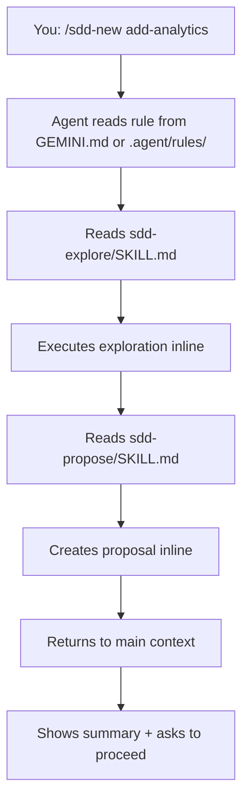

Antigravity is Google's AI-first IDE with native skill support. It uses its own skill and rule system separate from VS Code, making it ideal for Agent Teams Lite.

## Prerequisites

- Antigravity installed and configured
- Git installed for cloning the repository
- Access to `~/.gemini/antigravity/` directory (global) or `.agent/` (workspace)

## Installation Steps

<Steps>
  <Step title="Clone the repository">
    ```bash
    git clone https://github.com/gentleman-programming/agent-teams-lite.git
    cd agent-teams-lite
    ```
  </Step>
  
  <Step title="Choose installation scope">
    Antigravity supports both global and workspace-specific installations.
    
    <Tabs>
      <Tab title="Global (Recommended)">
        Available across all projects:
        
        <CodeGroup>
        ```bash Interactive
        ./scripts/install.sh
        # Choose option 6: Antigravity
        ```
        
        ```bash Non-Interactive
        ./scripts/install.sh --agent antigravity
        ```
        </CodeGroup>
        
        Skills install to `~/.gemini/antigravity/skills/sdd-*/`
      </Tab>
      
      <Tab title="Workspace-Specific">
        Only available in current project:
        
        ```bash
        # Copy skills to workspace
        mkdir -p .agent/skills
        cp -r skills/sdd-* .agent/skills/
        cp -r skills/_shared .agent/skills/
        ```
        
        Skills install to `.agent/skills/sdd-*/`
      </Tab>
    </Tabs>
    
    You should see output like:
    ```
    Installing skills for Antigravity...
      ✓ _shared (3 convention files)
      ✓ sdd-init
      ✓ sdd-explore
      ✓ sdd-propose
      ✓ sdd-spec
      ✓ sdd-design
      ✓ sdd-tasks
      ✓ sdd-apply
      ✓ sdd-verify
      ✓ sdd-archive

      9 skills installed → ~/.gemini/antigravity/skills
    ```
  </Step>
  
  <Step title="Add orchestrator rule">
    Antigravity uses "rules" for agent instructions. Add the SDD orchestrator as a rule.
    
    <Tabs>
      <Tab title="Global Rule">
        Add to `~/.gemini/GEMINI.md`:
        
        ```bash
        code ~/.gemini/GEMINI.md
        ```
        
        Append the contents from `examples/antigravity/sdd-orchestrator.md`.
      </Tab>
      
      <Tab title="Workspace Rule">
        Create workspace-specific rule:
        
        ```bash
        mkdir -p .agent/rules
        cp examples/antigravity/sdd-orchestrator.md .agent/rules/sdd-orchestrator.md
        ```
      </Tab>
    </Tabs>
    
    <Accordion title="View orchestrator rule content">
    The orchestrator rule teaches Antigravity to:
    - Detect SDD triggers and commands
    - Read skill files from the appropriate path
    - Execute skills inline (within current context)
    - Track state between phases
    - Follow artifact storage policies (engram/openspec/none)
    
    Key sections:
    - Operating Mode (delegate-only principle)
    - Artifact Store Policy
    - Commands table
    - Command → Skill Mapping
    - Engram Artifact Convention
    </Accordion>
  </Step>
  
  <Step title="Verify installation">
    Open Antigravity in any project and open the agent panel.
    
    Type:
    ```
    /sdd-init
    ```
    
    Expected response:
    ```
    Reading sdd-init skill...
    
    ✓ Detected stack: [your project's stack]
    ✓ SDD initialized
    ```
  </Step>
</Steps>

## Configuration Locations

<CardGroup cols={3}>
  <Card title="Global Skills" icon="folder">
    `~/.gemini/antigravity/skills/sdd-*/`
    
    Available across all projects
  </Card>
  
  <Card title="Workspace Skills" icon="folder-tree">
    `.agent/skills/sdd-*/`
    
    Project-specific skills
  </Card>
  
  <Card title="Rules" icon="file">
    `~/.gemini/GEMINI.md` (global)
    
    `.agent/rules/` (workspace)
  </Card>
</CardGroup>

## Antigravity-Specific Paths

<Warning>
  Antigravity does NOT use `.vscode/` paths. It has its own convention:
  
  - Global: `~/.gemini/antigravity/skills/`
  - Workspace: `.agent/skills/` and `.agent/rules/`
</Warning>

### Global vs Workspace

| Aspect | Global | Workspace |
|--------|--------|------------|
| Skills path | `~/.gemini/antigravity/skills/` | `.agent/skills/` |
| Rules path | `~/.gemini/GEMINI.md` | `.agent/rules/` |
| Scope | All projects | Current project only |
| Team sharing | No | Yes (commit .agent/) |
| Setup | One-time | Per-project |

## How It Works

Antigravity has native skill support but runs them inline:



**Characteristics:**
- Native skill awareness (Antigravity can discover and suggest skills)
- Inline execution (not true sub-agents)
- Skills work as structured instructions
- Planning phases work well
- Implementation guided by skill instructions

## Example Usage

### Initialize SDD

```
You: /sdd-init

Antigravity: Reading sdd-init skill from global skills directory...
             
             Analyzing project...
             ✓ Framework: Flutter
             ✓ Language: Dart
             ✓ State management: Riverpod
             ✓ Backend: Firebase
             
             Checking persistence backend...
             ✓ Engram MCP server detected
             
             SDD initialized:
             - Project: my-flutter-app
             - Artifact store: engram
             
             Ready to start building.
```

### Start a New Feature

```
You: /sdd-new add-offline-mode

Antigravity: Exploring codebase for offline capabilities...
             
             ✓ No offline persistence detected
             ✓ Firebase client: lib/services/firebase_service.dart
             ✓ Hive available (local database)
             
             Creating proposal...
             
             Proposal Summary:
             - Intent: Add offline mode with sync when online
             - Scope: Local storage layer, sync queue, connectivity detection
             - Approach: Hive for local storage, Firebase for sync, connectivity_plus for detection
             - Rollback: Remove Hive boxes, remove sync service, revert to online-only
             
             Artifact stored: sdd/add-offline-mode/proposal
             
             Ready to continue with specs and design?
```

### Fast-Forward Planning

```
You: /sdd-ff add-offline-mode

Antigravity: Running all planning phases...
             
             Creating specifications...
             ✓ 6 requirements (SHALL statements)
             ✓ 13 scenarios (Given/When/Then)
             ✓ Stored: sdd/add-offline-mode/spec
             
             Creating technical design...
             ✓ Architecture: Repository pattern with local + remote data sources
             ✓ Sync strategy: Queue operations, batch sync on reconnect
             ✓ Conflict resolution: Last-write-wins with timestamp
             ✓ Stored: sdd/add-offline-mode/design
             
             Creating task breakdown...
             ✓ Phase 1: Local storage (3 tasks)
             ✓ Phase 2: Sync service (4 tasks)
             ✓ Phase 3: Connectivity handling (2 tasks)
             ✓ Total: 9 tasks
             ✓ Stored: sdd/add-offline-mode/tasks
             
             All planning complete. Run /sdd-apply to implement.
```

## Artifact Storage

<Tabs>
  <Tab title="engram (Recommended)">
    ```yaml
    # Auto-detected if Engram MCP server is available
    artifact_store:
      mode: engram
    ```
    
    Antigravity can use Engram's MCP server:
    
    **Naming convention:**
    ```
    title:     sdd/add-offline-mode/proposal
    topic_key: sdd/add-offline-mode/proposal
    type:      architecture
    project:   my-flutter-app
    ```
  </Tab>
  
  <Tab title="openspec">
    ```yaml
    # Only when explicitly requested
    artifact_store:
      mode: openspec
    ```
    
    Creates file-based artifacts:
    ```
    openspec/
    ├── config.yaml
    ├── specs/
    └── changes/
        └── add-offline-mode/
            ├── proposal.md
            ├── specs/
            ├── design.md
            └── tasks.md
    ```
  </Tab>
  
  <Tab title="none">
    ```yaml
    # Ephemeral mode - default fallback
    artifact_store:
      mode: none
    ```
    
    No persistence. Results returned inline.
  </Tab>
</Tabs>

## Team Setup with Workspace Skills

To share SDD with your team using workspace-specific installation:

<Steps>
  <Step title="Install skills to workspace">
    ```bash
    mkdir -p .agent/skills
    cp -r skills/sdd-* .agent/skills/
    cp -r skills/_shared .agent/skills/
    ```
  </Step>
  
  <Step title="Add workspace rule">
    ```bash
    mkdir -p .agent/rules
    cp examples/antigravity/sdd-orchestrator.md .agent/rules/sdd-orchestrator.md
    ```
  </Step>
  
  <Step title="Commit to repository">
    ```bash
    git add .agent/
    git commit -m "Add Agent Teams Lite SDD workflow"
    git push
    ```
  </Step>
  
  <Step title="Team members get SDD automatically">
    When team members pull, they get SDD automatically:
    ```bash
    git pull
    # Open in Antigravity
    # /sdd-init is now available
    ```
  </Step>
</Steps>

## Verification Checklist

<Steps>
  <Step title="Check skills directory (global)">
    ```bash
    ls ~/.gemini/antigravity/skills/sdd-*/
    ```
    
    Should show 9 directories:
    ```
    sdd-apply/  sdd-design/  sdd-init/  sdd-spec/
    sdd-archive/  sdd-explore/  sdd-propose/  sdd-tasks/  sdd-verify/
    ```
  </Step>
  
  <Step title="Check skills directory (workspace)">
    ```bash
    ls .agent/skills/sdd-*/
    ```
    
    Should show same 9 directories if using workspace installation.
  </Step>
  
  <Step title="Check shared conventions">
    ```bash
    ls ~/.gemini/antigravity/skills/_shared/
    # or
    ls .agent/skills/_shared/
    ```
    
    Should show:
    ```
    engram-convention.md
    openspec-convention.md
    persistence-contract.md
    ```
  </Step>
  
  <Step title="Verify rule is configured">
    ```bash
    cat ~/.gemini/GEMINI.md | grep -i "sdd"
    # or
    ls .agent/rules/sdd-orchestrator.md
    ```
  </Step>
  
  <Step title="Test in Antigravity">
    Open Antigravity agent panel and type:
    ```
    /sdd-init
    ```
    
    Should recognize the command and read the skill.
  </Step>
</Steps>

## Troubleshooting

<AccordionGroup>
  <Accordion title="Command not recognized">
    **Problem:** Antigravity doesn't recognize `/sdd-init`
    
    **Solutions:**
    1. Verify rule is in `~/.gemini/GEMINI.md` or `.agent/rules/`
    2. Check skills are in correct path (NOT `.vscode/`)
    3. Restart Antigravity to reload configuration
    4. Try alternative phrasing: "Initialize SDD"
  </Accordion>
  
  <Accordion title="Skills not found">
    **Problem:** Antigravity can't read skill files
    
    **Solutions:**
    1. Check skills path:
       - Global: `~/.gemini/antigravity/skills/sdd-*/`
       - Workspace: `.agent/skills/sdd-*/`
    2. Do NOT use `.vscode/skills/` - that's for VS Code only
    3. Ensure file permissions allow reading
    4. Verify each skill has `SKILL.md` file
  </Accordion>
  
  <Accordion title="Wrong path used">
    **Problem:** Skills installed to `.vscode/` instead of `.agent/`
    
    **Solutions:**
    1. Remove incorrect installation: `rm -rf .vscode/skills/sdd-*`
    2. Install to correct location:
       ```bash
       mkdir -p .agent/skills
       cp -r skills/sdd-* .agent/skills/
       ```
    3. Update rule to reference `.agent/skills/` path
  </Accordion>
  
  <Accordion title="Rule not loading">
    **Problem:** Orchestrator behavior not active
    
    **Solutions:**
    1. Check global rule: `~/.gemini/GEMINI.md`
    2. Check workspace rule: `.agent/rules/sdd-orchestrator.md`
    3. Ensure file is readable
    4. Restart Antigravity after making changes
  </Accordion>
</AccordionGroup>

## Next Steps

<CardGroup cols={2}>
  <Card title="Quick Start" icon="rocket" href="/quickstart">
    Learn the SDD workflow
  </Card>
  
  <Card title="Commands Reference" icon="book" href="/commands/overview">
    Complete command documentation
  </Card>
  
  <Card title="Engram Setup" icon="database" href="/guides/persistence">
    Install recommended persistence
  </Card>
  
  <Card title="Team Workflows" icon="users" href="/guides/workflow">
    Share SDD with your team
  </Card>
</CardGroup>