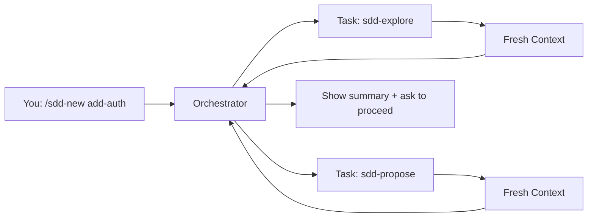

Claude Code provides **full sub-agent support** via its Task tool. Each SDD phase runs in a fresh context window, making it ideal for complex feature development.

## Prerequisites

- Claude Code installed and configured
- Git installed for cloning the repository
- Access to `~/.claude/` directory

## Installation Steps

<Steps>
  <Step title="Clone the repository">
    ```bash
    git clone https://github.com/gentleman-programming/agent-teams-lite.git
    cd agent-teams-lite
    ```
  </Step>
  
  <Step title="Run the installer">
    <CodeGroup>
    ```bash Interactive
    ./scripts/install.sh
    # Choose option 1: Claude Code
    ```
    
    ```bash Non-Interactive
    ./scripts/install.sh --agent claude-code
    ```
    </CodeGroup>
    
    This copies skills to `~/.claude/skills/sdd-*/`
    
    You should see output like:
    ```
    Installing skills for Claude Code...
      ✓ _shared (3 convention files)
      ✓ sdd-init
      ✓ sdd-explore
      ✓ sdd-propose
      ✓ sdd-spec
      ✓ sdd-design
      ✓ sdd-tasks
      ✓ sdd-apply
      ✓ sdd-verify
      ✓ sdd-archive

      9 skills installed → ~/.claude/skills
    ```
  </Step>
  
  <Step title="Add orchestrator to CLAUDE.md">
    The installer will prompt you to add orchestrator instructions to `~/.claude/CLAUDE.md`.
    
    Open your existing `CLAUDE.md` file:
    ```bash
    code ~/.claude/CLAUDE.md
    ```
    
    Append the contents from `examples/claude-code/CLAUDE.md` to your existing file. This preserves your current assistant identity while adding SDD capabilities.
    
    <Accordion title="View orchestrator instructions">
    The orchestrator section teaches Claude Code to:
    - Detect SDD triggers (`/sdd-new`, feature descriptions, etc.)
    - Launch sub-agents via the Task tool
    - Pass skill file paths to sub-agents
    - Track state between phases
    - Follow artifact storage policies (engram/openspec/none)
    
    Key sections added:
    - Artifact Store Policy (engram/openspec/none)
    - SDD Commands table
    - Command → Skill Mapping
    - Orchestrator Rules
    - Engram Artifact Convention
    </Accordion>
  </Step>
  
  <Step title="Verify installation">
    Open Claude Code in any project directory:
    ```bash
    claude-code .
    ```
    
    Type:
    ```
    /sdd-init
    ```
    
    Expected response:
    ```
    Launching sdd-init sub-agent to bootstrap project context...
    ✓ Detected stack: [your project's stack]
    ✓ SDD initialized
    ```
    
    If Claude Code doesn't recognize the command, verify:
    1. Skills are in `~/.claude/skills/sdd-*/`
    2. Orchestrator instructions are in `~/.claude/CLAUDE.md`
    3. You've restarted Claude Code after making changes
  </Step>
</Steps>

## Configuration Locations

<CardGroup cols={2}>
  <Card title="Skills Directory" icon="folder">
    `~/.claude/skills/sdd-*/`
    
    Contains 9 skill folders + `_shared/` conventions
  </Card>
  
  <Card title="Orchestrator Config" icon="file">
    `~/.claude/CLAUDE.md`
    
    Your main assistant configuration file
  </Card>
</CardGroup>

## How It Works

Claude Code's Task tool enables true sub-agent delegation:



Each sub-agent:
1. Gets launched via `Task(subagent_type: 'general', prompt: 'Read skill at ~/.claude/skills/sdd-explore/SKILL.md...')`
2. Starts with fresh context (no history from orchestrator)
3. Reads its skill instructions
4. Executes the phase work
5. Returns structured results to orchestrator

## Example Usage

### Initialize SDD

```
You: /sdd-init

Claude: Launching sdd-init sub-agent...
        ✓ Detected stack: React + TypeScript + Tailwind
        ✓ Project: my-app
        ✓ Artifact store: engram (Engram detected)
        
        SDD initialized. Ready to start building.
```

### Start a New Feature

```
You: /sdd-new add-dark-mode

Claude: Launching explorer sub-agent to analyze codebase...
        ✓ Current theme: hardcoded light mode in globals.css
        ✓ No theme context detected
        
        Launching proposal sub-agent...
        ✓ Proposal created: sdd/add-dark-mode/proposal
        
        Summary:
        - Intent: Add dark mode toggle with system preference detection
        - Scope: Theme context, toggle component, CSS variables
        - Rollback: Remove ThemeProvider, revert CSS
        
        Ready to continue with specs and design? (or review proposal first)
```

### Fast-Forward Planning

```
You: /sdd-ff add-dark-mode

Claude: Running all planning phases...
        
        Launching spec sub-agent...
        ✓ specs/ui/spec.md — 3 requirements, 7 scenarios
        
        Launching design sub-agent...
        ✓ design.md — CSS variables approach, React Context, localStorage
        
        Launching tasks sub-agent...
        ✓ tasks.md — 3 phases, 8 tasks
        
        All planning complete. Run /sdd-apply to implement.
```

## Artifact Storage

Claude Code supports all three storage modes:

<Tabs>
  <Tab title="engram (Recommended)">
    ```yaml
    # Auto-detected if Engram MCP server is available
    artifact_store:
      mode: engram
    ```
    
    Artifacts are stored via Engram's `mem_observe` tool with deterministic naming:
    ```
    title:     sdd/add-dark-mode/proposal
    topic_key: sdd/add-dark-mode/proposal
    type:      architecture
    project:   my-app
    ```
    
    Recovery uses two-step protocol:
    1. `mem_search(query: "sdd/add-dark-mode/proposal", project: "my-app")`
    2. `mem_get_observation(id)` — get full content
  </Tab>
  
  <Tab title="openspec">
    ```yaml
    # Only when you explicitly request file artifacts
    artifact_store:
      mode: openspec
    ```
    
    Creates file-based artifacts:
    ```
    openspec/
    ├── config.yaml
    ├── specs/
    └── changes/
        └── add-dark-mode/
            ├── proposal.md
            ├── specs/
            ├── design.md
            └── tasks.md
    ```
  </Tab>
  
  <Tab title="none">
    ```yaml
    # Ephemeral mode - no persistence
    artifact_store:
      mode: none
    ```
    
    Results returned inline only. No files written. Good for exploration or privacy-sensitive projects.
  </Tab>
</Tabs>

## Verification Checklist

<Steps>
  <Step title="Check skills are installed">
    ```bash
    ls ~/.claude/skills/sdd-*/
    ```
    
    Should show 9 directories:
    ```
    sdd-apply/  sdd-design/    sdd-init/     sdd-spec/
    sdd-archive/  sdd-explore/  sdd-propose/  sdd-tasks/  sdd-verify/
    ```
  </Step>
  
  <Step title="Check shared conventions">
    ```bash
    ls ~/.claude/skills/_shared/
    ```
    
    Should show:
    ```
    engram-convention.md
    openspec-convention.md
    persistence-contract.md
    ```
  </Step>
  
  <Step title="Verify CLAUDE.md contains SDD section">
    ```bash
    grep -i "sdd orchestrator" ~/.claude/CLAUDE.md
    ```
    
    Should return matches if orchestrator instructions are present.
  </Step>
  
  <Step title="Test SDD command">
    ```bash
    claude-code .
    # In Claude Code prompt:
    # /sdd-init
    ```
    
    Should recognize the command and launch sdd-init sub-agent.
  </Step>
</Steps>

## Troubleshooting

<AccordionGroup>
  <Accordion title="Command not recognized">
    **Problem:** Claude Code doesn't recognize `/sdd-init`
    
    **Solutions:**
    1. Verify skills are in `~/.claude/skills/sdd-*/`
    2. Check orchestrator instructions are appended to `~/.claude/CLAUDE.md`
    3. Restart Claude Code to reload configuration
    4. Try alternative phrasing: "Initialize SDD" or "Start spec-driven development"
  </Accordion>
  
  <Accordion title="Sub-agent not launching">
    **Problem:** Orchestrator doesn't use Task tool
    
    **Solutions:**
    1. Ensure orchestrator instructions mention Task tool explicitly
    2. Verify skill file paths are correct: `~/.claude/skills/sdd-{name}/SKILL.md`
    3. Check Claude Code version supports Task tool (update if needed)
  </Accordion>
  
  <Accordion title="Artifacts not persisting">
    **Problem:** Results shown but not saved
    
    **Solutions:**
    1. Check artifact_store mode: engram requires Engram MCP server
    2. Verify Engram is running: check MCP server status
    3. Explicitly request openspec mode if you want file-based artifacts
    4. In none mode, persistence is intentionally disabled
  </Accordion>
</AccordionGroup>

## Next Steps

<CardGroup cols={2}>
  <Card title="Quick Start" icon="rocket" href="/quickstart">
    Learn how to use SDD commands
  </Card>
  
  <Card title="Commands Reference" icon="terminal" href="/commands/overview">
    Complete command documentation
  </Card>
  
  <Card title="Engram Setup" icon="database" href="/guides/persistence">
    Install recommended persistence backend
  </Card>
  
  <Card title="Workflow Guide" icon="diagram-project" href="/guides/workflow">
    Understand the SDD workflow
  </Card>
</CardGroup>