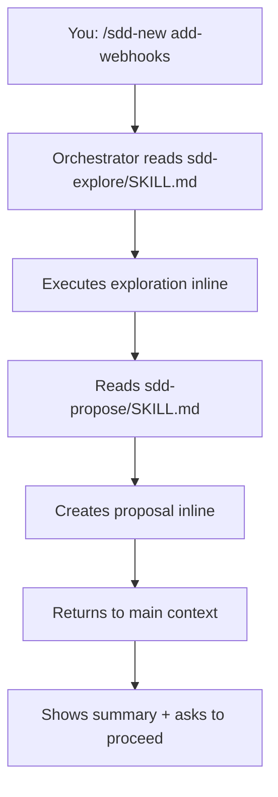

Codex runs Agent Teams Lite skills inline within a single context window. The structured SDD workflow provides value for planning and implementation, though without the fresh-context benefits of true sub-agent delegation.

## Prerequisites

- Codex installed and configured
- Git installed for cloning the repository
- Access to `~/.codex/` directory

## Installation Steps

<Steps>
  <Step title="Clone the repository">
    ```bash
    git clone https://github.com/gentleman-programming/agent-teams-lite.git
    cd agent-teams-lite
    ```
  </Step>
  
  <Step title="Run the installer">
    <CodeGroup>
    ```bash Interactive
    ./scripts/install.sh
    # Choose option 4: Codex
    ```
    
    ```bash Non-Interactive
    ./scripts/install.sh --agent codex
    ```
    </CodeGroup>
    
    This copies skills to `~/.codex/skills/sdd-*/`
    
    You should see output like:
    ```
    Installing skills for Codex...
      ✓ _shared (3 convention files)
      ✓ sdd-init
      ✓ sdd-explore
      ✓ sdd-propose
      ✓ sdd-spec
      ✓ sdd-design
      ✓ sdd-tasks
      ✓ sdd-apply
      ✓ sdd-verify
      ✓ sdd-archive

      9 skills installed → ~/.codex/skills
    ```
  </Step>
  
  <Step title="Add orchestrator to instructions file">
    Codex reads instructions from `~/.codex/agents.md` (or your configured `model_instructions_file`).
    
    Open your instructions file:
    ```bash
    code ~/.codex/agents.md
    ```
    
    Append the contents from `examples/codex/agents.md` to your existing file.
    
    <Accordion title="View orchestrator instructions">
    The orchestrator section teaches Codex to:
    - Detect SDD triggers and commands
    - Read skill files from `~/.codex/skills/sdd-*/SKILL.md`
    - Execute skills inline within current context
    - Track state between phases
    - Follow artifact storage policies
    
    Key components:
    - Operating Mode (delegate-only principle)
    - Artifact Store Policy (engram/openspec/none)
    - Commands table
    - Command → Skill Mapping
    - Dependency graph
    - Engram Artifact Convention
    </Accordion>
  </Step>
  
  <Step title="Verify installation">
    Start Codex in any project:
    ```bash
    codex
    ```
    
    Type:
    ```
    /sdd-init
    ```
    
    Expected response:
    ```
    Reading sdd-init skill from ~/.codex/skills/sdd-init/SKILL.md...
    
    Detecting project stack...
    ✓ Stack detected
    ✓ SDD initialized
    ```
  </Step>
</Steps>

## Configuration Locations

<CardGroup cols={2}>
  <Card title="Skills Directory" icon="folder">
    `~/.codex/skills/sdd-*/`
    
    Contains 9 skill folders + `_shared/` conventions
  </Card>
  
  <Card title="Instructions File" icon="file">
    `~/.codex/agents.md`
    
    Orchestrator instructions and agent configuration
  </Card>
</CardGroup>

## Custom Instructions Path

If you've configured a custom instructions file:

```bash
# Check your Codex config for model_instructions_file
cat ~/.codex/config.json | grep model_instructions_file
```

Add the orchestrator instructions to that file instead of `agents.md`.

## How Inline Execution Works

Codex doesn't have a Task tool for sub-agent delegation. Skills run inline:



**Characteristics:**
- Skills execute in the same context window
- No fresh context per phase
- Planning phases work well
- Implementation batching handled by orchestrator
- More context usage than true sub-agent systems

## Example Usage

### Initialize SDD

```
You: /sdd-init

Codex: Reading sdd-init skill...
       
       Detecting project characteristics...
       ✓ Language: Python
       ✓ Framework: FastAPI
       ✓ Database: PostgreSQL + SQLAlchemy
       
       Checking for persistence backend...
       ✓ Engram MCP server detected
       
       SDD initialized:
       - Project: my-api
       - Artifact store: engram
       
       Ready to start building.
```

### Start a New Feature

```
You: /sdd-new add-webhook-support

Codex: Exploring codebase for webhook-related functionality...
       
       Reading sdd-explore skill...
       ✓ No existing webhook handlers found
       ✓ Event system detected in events.py
       ✓ Redis available for delivery queue
       
       Reading sdd-propose skill...
       
       Creating proposal:
       
       Intent:
       Add webhook delivery system for event notifications
       
       Scope:
       - Webhook CRUD endpoints
       - Event subscription model
       - Background delivery worker (Redis queue)
       - Retry logic with exponential backoff
       
       Approach:
       - FastAPI endpoints for webhook management
       - SQLAlchemy models for subscriptions
       - Celery tasks for async delivery
       - Webhook signature verification (HMAC)
       
       Rollback:
       - Remove webhook tables
       - Remove Celery tasks
       - Remove delivery queue
       
       Artifact stored: sdd/add-webhook-support/proposal
       
       Ready to continue with specs and design?
```

### Continue Through Phases

```
You: /sdd-continue add-webhook-support

Codex: Next needed: specs and design
       
       Reading sdd-spec skill...
       Creating specifications...
       
       ✓ 5 requirements defined (SHALL statements)
       ✓ 11 scenarios with Given/When/Then
       ✓ Stored: sdd/add-webhook-support/spec
       
       Reading sdd-design skill...
       Creating technical design...
       
       ✓ Database schema (webhooks, deliveries tables)
       ✓ API routes (/webhooks CRUD + /webhooks/{id}/test)
       ✓ Celery task architecture
       ✓ Retry strategy (exponential backoff, max 5 attempts)
       ✓ Stored: sdd/add-webhook-support/design
       
       Next: Run /sdd-continue again to create task breakdown
```

### Fast-Forward Planning

```
You: /sdd-ff add-webhook-support

Codex: Running all planning phases...
       
       [Already complete: proposal, spec, design]
       
       Reading sdd-tasks skill...
       
       Breaking down into implementation tasks:
       
       Phase 1: Data Models (3 tasks)
       ✓ 1.1 Create Webhook model
       ✓ 1.2 Create WebhookDelivery model
       ✓ 1.3 Create database migration
       
       Phase 2: API Endpoints (4 tasks)
       ✓ 2.1 POST /webhooks (create)
       ✓ 2.2 GET /webhooks (list)
       ✓ 2.3 DELETE /webhooks/{id}
       ✓ 2.4 POST /webhooks/{id}/test (manual trigger)
       
       Phase 3: Delivery System (3 tasks)
       ✓ 3.1 Implement Celery task
       ✓ 3.2 Add retry logic
       ✓ 3.3 Integrate with event system
       
       Total: 10 tasks
       Stored: sdd/add-webhook-support/tasks
       
       All planning complete. Run /sdd-apply to implement.
```

## Artifact Storage

<Tabs>
  <Tab title="engram (Recommended)">
    ```yaml
    # Auto-detected if Engram MCP server is available
    artifact_store:
      mode: engram
    ```
    
    Codex can use Engram's MCP server for persistent storage:
    
    **Naming convention:**
    ```
    title:     sdd/add-webhook-support/proposal
    topic_key: sdd/add-webhook-support/proposal
    type:      architecture
    project:   my-api
    ```
    
    **Recovery:**
    ```
    1. mem_search(query: "sdd/add-webhook-support/proposal", project: "my-api")
    2. mem_get_observation(id)
    ```
  </Tab>
  
  <Tab title="openspec">
    ```yaml
    # Only when explicitly requested
    artifact_store:
      mode: openspec
    ```
    
    Creates file-based artifacts:
    ```
    openspec/
    ├── config.yaml
    ├── specs/
    └── changes/
        └── add-webhook-support/
            ├── proposal.md
            ├── specs/
            ├── design.md
            └── tasks.md
    ```
  </Tab>
  
  <Tab title="none">
    ```yaml
    # Ephemeral mode - default fallback
    artifact_store:
      mode: none
    ```
    
    No persistence. Results returned inline.
  </Tab>
</Tabs>

## Verification Checklist

<Steps>
  <Step title="Check skills directory">
    ```bash
    ls ~/.codex/skills/sdd-*/
    ```
    
    Should show 9 directories:
    ```
    sdd-apply/  sdd-design/  sdd-init/  sdd-spec/
    sdd-archive/  sdd-explore/  sdd-propose/  sdd-tasks/  sdd-verify/
    ```
  </Step>
  
  <Step title="Check shared conventions">
    ```bash
    ls ~/.codex/skills/_shared/
    ```
    
    Should show:
    ```
    engram-convention.md
    openspec-convention.md
    persistence-contract.md
    ```
  </Step>
  
  <Step title="Verify instructions file">
    ```bash
    cat ~/.codex/agents.md | grep -i "sdd orchestrator"
    ```
    
    Should return matches if orchestrator instructions are present.
  </Step>
  
  <Step title="Test SDD command">
    ```bash
    codex
    # In Codex prompt:
    # /sdd-init
    ```
    
    Should recognize the command and read the sdd-init skill.
  </Step>
</Steps>

## Troubleshooting

<AccordionGroup>
  <Accordion title="Command not recognized">
    **Problem:** Codex doesn't recognize `/sdd-init`
    
    **Solutions:**
    1. Verify orchestrator instructions are in `~/.codex/agents.md` (or your custom instructions file)
    2. Check file permissions allow reading
    3. Restart Codex to reload configuration
    4. Try alternative phrasing: "Initialize SDD" or "Set up spec-driven development"
  </Accordion>
  
  <Accordion title="Skills not found">
    **Problem:** Codex can't read skill files
    
    **Solutions:**
    1. Verify skills are in `~/.codex/skills/sdd-*/`
    2. Check each skill directory has `SKILL.md` file
    3. Ensure file permissions allow reading
    4. Check orchestrator instructions reference correct path
  </Accordion>
  
  <Accordion title="Instructions not loading">
    **Problem:** Orchestrator behavior not active
    
    **Solutions:**
    1. Verify instructions file location (check Codex config)
    2. Ensure file is named `agents.md` or matches `model_instructions_file` setting
    3. Check file is readable: `cat ~/.codex/agents.md`
    4. Restart Codex after making changes
  </Accordion>
  
  <Accordion title="Context issues on large features">
    **Problem:** Errors about context length
    
    **Solutions:**
    1. Use `/sdd-explore` first to understand scope
    2. Break large features into smaller changes
    3. Consider using Claude Code or OpenCode for large features
    4. Use `none` artifact mode to reduce context usage
  </Accordion>
</AccordionGroup>

## Limitations

<Warning>
  Codex runs skills inline rather than as true sub-agents. This means:
  
  - No fresh context per phase
  - Higher context usage
  - May hit context limits on large features
  - Planning phases work well
  - Implementation may need manual intervention on complex changes
</Warning>

For the best sub-agent experience with fresh context windows, consider:
- [Claude Code](/installation/claude-code) - Full sub-agent support
- [OpenCode](/installation/opencode) - Full sub-agent support with slash commands

## Next Steps

<CardGroup cols={2}>
  <Card title="Quick Start" icon="rocket" href="/quickstart">
    Learn the SDD workflow
  </Card>
  
  <Card title="Commands Reference" icon="book" href="/commands/overview">
    Complete command documentation
  </Card>
  
  <Card title="Engram Setup" icon="database" href="/guides/persistence">
    Install recommended persistence
  </Card>
  
  <Card title="OpenSpec Mode" icon="folder" href="/guides/persistence">
    File-based artifact storage
  </Card>
</CardGroup>