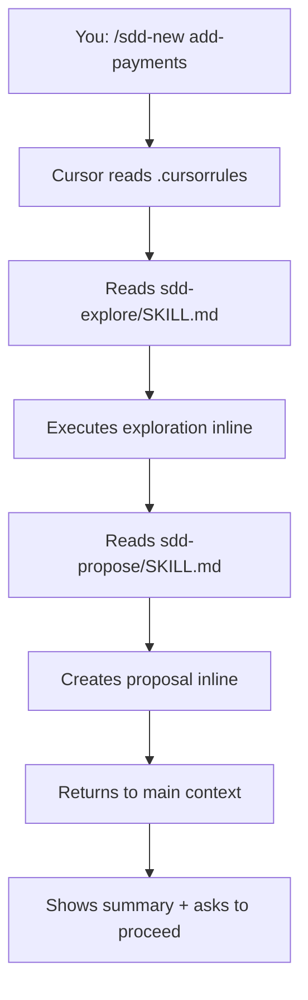

Cursor supports Agent Teams Lite through `.cursorrules` files. Skills work as inline instructions, providing structured SDD workflow within Cursor's AI-first editing experience.

## Prerequisites

- Cursor installed and configured
- Git installed for cloning the repository
- Access to `~/.cursor/skills/` (global) or project directory (project-local)

## Installation Steps

<Steps>
  <Step title="Clone the repository">
    ```bash
    git clone https://github.com/gentleman-programming/agent-teams-lite.git
    cd agent-teams-lite
    ```
  </Step>
  
  <Step title="Choose installation scope">
    Cursor supports both global and project-local installations.
    
    <Tabs>
      <Tab title="Global (Recommended)">
        Available across all projects:
        
        <CodeGroup>
        ```bash Interactive
        ./scripts/install.sh
        # Choose option 7: Cursor
        ```
        
        ```bash Non-Interactive
        ./scripts/install.sh --agent cursor
        ```
        </CodeGroup>
        
        Skills install to `~/.cursor/skills/sdd-*/`
      </Tab>
      
      <Tab title="Project-Local">
        Only available in current project:
        
        ```bash
        # Copy skills to project
        mkdir -p skills
        cp -r skills/sdd-* ./skills/
        cp -r skills/_shared ./skills/
        ```
        
        Skills install to `./skills/sdd-*/`
      </Tab>
    </Tabs>
    
    You should see output like:
    ```
    Installing skills for Cursor...
      ✓ _shared (3 convention files)
      ✓ sdd-init
      ✓ sdd-explore
      ✓ sdd-propose
      ✓ sdd-spec
      ✓ sdd-design
      ✓ sdd-tasks
      ✓ sdd-apply
      ✓ sdd-verify
      ✓ sdd-archive

      9 skills installed → ~/.cursor/skills
    ```
  </Step>
  
  <Step title="Add orchestrator to .cursorrules">
    Cursor reads AI instructions from `.cursorrules` files in your project root.
    
    Navigate to your project directory and create or edit `.cursorrules`:
    
    ```bash
    cd your-project
    code .cursorrules
    ```
    
    Append the contents from `examples/cursor/.cursorrules`.
    
    <Accordion title="View orchestrator rules">
    The orchestrator rules teach Cursor to:
    - Detect SDD triggers and commands
    - Read skill files from `~/.cursor/skills/sdd-*/SKILL.md` (or `./skills/`)
    - Execute skills inline within current context
    - Track state between phases
    - Follow artifact storage policies (engram/openspec/none)
    
    Key sections:
    - Operating Mode (delegate-only principle)
    - Artifact Store Policy
    - Commands table
    - Command → Skill Mapping
    - Dependency graph
    - Engram Artifact Convention
    </Accordion>
    
    <Info>
      `.cursorrules` files are project-specific. Add SDD rules to each project where you want to use it, or include it in your project template.
    </Info>
  </Step>
  
  <Step title="Verify installation">
    Open Cursor in your project:
    ```bash
    cursor .
    ```
    
    Open the AI chat panel (Cmd+L / Ctrl+L) and type:
    ```
    /sdd-init
    ```
    
    Expected response:
    ```
    Reading sdd-init skill from ~/.cursor/skills/sdd-init/SKILL.md...
    
    ✓ Detected stack: [your project's stack]
    ✓ SDD initialized
    ```
  </Step>
</Steps>

## Configuration Locations

<CardGroup cols={3}>
  <Card title="Global Skills" icon="folder">
    `~/.cursor/skills/sdd-*/`
    
    Available across all projects
  </Card>
  
  <Card title="Project Skills" icon="folder-tree">
    `./skills/sdd-*/`
    
    Project-specific skills
  </Card>
  
  <Card title="Rules" icon="file">
    `.cursorrules`
    
    Project-level AI instructions
  </Card>
</CardGroup>

## How It Works

Cursor doesn't have a Task tool for sub-agent delegation. Skills run inline:



**Characteristics:**
- Skills execute in the same context window
- No fresh context per phase
- Still provides structured workflow
- Planning phases work well
- Implementation guided by skill instructions
- Orchestrator handles batching

## Example Usage

### Initialize SDD

```
You: /sdd-init

Cursor: Reading sdd-init skill...
        
        Analyzing project...
        ✓ Framework: Next.js 14 (App Router)
        ✓ Language: TypeScript
        ✓ Database: Prisma + PostgreSQL
        ✓ Styling: Tailwind CSS
        
        Checking for persistence backend...
        ✓ Engram MCP server detected
        
        SDD initialized:
        - Project: my-saas
        - Artifact store: engram
        
        Ready to start building.
```

### Start a New Feature

```
You: /sdd-new add-stripe-integration

Cursor: Exploring codebase for payment-related code...
        
        ✓ No existing payment integration
        ✓ API routes: app/api/
        ✓ Auth: NextAuth.js with session
        ✓ User model has userId field
        
        Creating proposal...
        
        Proposal Summary:
        - Intent: Integrate Stripe for subscription payments
        - Scope: Stripe SDK setup, webhook handling, subscription management
        - Approach: Stripe Checkout for payments, webhooks for events, Prisma for subscription state
        - Rollback: Remove Stripe API routes, drop subscription tables, remove webhook endpoint
        
        Artifact stored: sdd/add-stripe-integration/proposal
        
        Ready to continue with specs and design?
```

### Fast-Forward Planning

```
You: /sdd-ff add-stripe-integration

Cursor: Running all planning phases...
        
        Creating specifications...
        ✓ 7 requirements (SHALL statements for payment, webhook, subscription)
        ✓ 15 scenarios (checkout flow, webhook handling, cancellation, etc.)
        ✓ Stored: sdd/add-stripe-integration/spec
        
        Creating technical design...
        ✓ Stripe SDK initialization in lib/stripe.ts
        ✓ API routes: /api/checkout, /api/webhooks/stripe
        ✓ Database models: Subscription, Payment
        ✓ Webhook signature verification
        ✓ Environment variables: STRIPE_SECRET_KEY, STRIPE_WEBHOOK_SECRET
        ✓ Stored: sdd/add-stripe-integration/design
        
        Creating task breakdown...
        ✓ Phase 1: Stripe setup (3 tasks)
        ✓ Phase 2: Checkout flow (4 tasks)
        ✓ Phase 3: Webhook handling (3 tasks)
        ✓ Phase 4: Subscription UI (3 tasks)
        ✓ Total: 13 tasks
        ✓ Stored: sdd/add-stripe-integration/tasks
        
        All planning complete. Run /sdd-apply to implement.
```

### Apply Changes

```
You: /sdd-apply add-stripe-integration

Cursor: Implementing tasks from sdd/add-stripe-integration/tasks...
        
        Phase 1: Stripe setup
        ✓ 1.1 Install stripe package
        ✓ 1.2 Create lib/stripe.ts with SDK initialization
        ✓ 1.3 Add environment variables to .env.example
        
        Phase 2: Checkout flow
        ✓ 2.1 Create POST /api/checkout endpoint
        ✓ 2.2 Generate Checkout Session
        ✓ 2.3 Add success/cancel redirect URLs
        ✓ 2.4 Create SubscribeButton component
        
        4/13 tasks complete. Continue with Phase 3?
```

## Artifact Storage

<Tabs>
  <Tab title="engram (Recommended)">
    ```yaml
    # Auto-detected if Engram MCP server is available
    artifact_store:
      mode: engram
    ```
    
    Cursor can use Engram's MCP server for persistent storage:
    
    **Naming convention:**
    ```
    title:     sdd/add-stripe-integration/proposal
    topic_key: sdd/add-stripe-integration/proposal
    type:      architecture
    project:   my-saas
    ```
    
    Benefits:
    - Repository stays clean
    - Persistent across sessions
    - Searchable via mem_search
  </Tab>
  
  <Tab title="openspec">
    ```yaml
    # Only when explicitly requested
    artifact_store:
      mode: openspec
    ```
    
    Creates file-based artifacts in your project:
    ```
    openspec/
    ├── config.yaml
    ├── specs/
    └── changes/
        └── add-stripe-integration/
            ├── proposal.md
            ├── specs/
            ├── design.md
            └── tasks.md
    ```
  </Tab>
  
  <Tab title="none">
    ```yaml
    # Ephemeral mode - default fallback
    artifact_store:
      mode: none
    ```
    
    No persistence. Results returned inline only.
  </Tab>
</Tabs>

## Team Setup

To share SDD with your team:

<Steps>
  <Step title="Commit .cursorrules to repository">
    ```bash
    git add .cursorrules
    git commit -m "Add Agent Teams Lite SDD workflow"
    git push
    ```
  </Step>
  
  <Step title="(Optional) Commit project-local skills">
    If using project-local skills instead of global:
    
    ```bash
    git add skills/
    git commit -m "Add SDD skills for local reference"
    git push
    ```
  </Step>
  
  <Step title="Document in README">
    Add to your project's README:
    
    ```markdown
    ## Development Workflow
    
    This project uses Spec-Driven Development (SDD) via Agent Teams Lite.
    
    ### Setup for Team Members
    
    Install skills globally:
    ```bash
    git clone https://github.com/gentleman-programming/agent-teams-lite.git
    cd agent-teams-lite
    ./scripts/install.sh --agent cursor
    ```
    
    ### Usage
    
    Open Cursor and run:
    - `/sdd-init` - Initialize SDD context
    - `/sdd-new <feature>` - Start a new feature
    - `/sdd-apply` - Implement tasks
    
    See `.cursorrules` for complete command reference.
    ```
  </Step>
  
  <Step title="Team members get rules automatically">
    When team members pull, they get `.cursorrules` automatically:
    ```bash
    git pull
    cursor .
    # SDD rules are now active
    ```
    
    They'll need to install skills globally (one-time setup).
  </Step>
</Steps>

## Verification Checklist

<Steps>
  <Step title="Check skills directory (global)">
    ```bash
    ls ~/.cursor/skills/sdd-*/
    ```
    
    Should show 9 directories:
    ```
    sdd-apply/  sdd-design/  sdd-init/  sdd-spec/
    sdd-archive/  sdd-explore/  sdd-propose/  sdd-tasks/  sdd-verify/
    ```
  </Step>
  
  <Step title="Check skills directory (project-local)">
    If using project-local installation:
    ```bash
    ls ./skills/sdd-*/
    ```
    
    Should show same 9 directories.
  </Step>
  
  <Step title="Check shared conventions">
    ```bash
    ls ~/.cursor/skills/_shared/
    # or
    ls ./skills/_shared/
    ```
    
    Should show:
    ```
    engram-convention.md
    openspec-convention.md
    persistence-contract.md
    ```
  </Step>
  
  <Step title="Verify .cursorrules exists">
    ```bash
    cat .cursorrules | grep -i "sdd"
    ```
    
    Should return matches if orchestrator rules are present.
  </Step>
  
  <Step title="Test in Cursor">
    ```bash
    cursor .
    # Open AI panel (Cmd+L / Ctrl+L)
    # Type: /sdd-init
    ```
    
    Should recognize the command and read the skill.
  </Step>
</Steps>

## Troubleshooting

<AccordionGroup>
  <Accordion title="Command not recognized">
    **Problem:** Cursor doesn't recognize `/sdd-init`
    
    **Solutions:**
    1. Verify `.cursorrules` exists in project root
    2. Check orchestrator rules are appended to `.cursorrules`
    3. Restart Cursor to reload configuration
    4. Try alternative phrasing: "Initialize SDD for this project"
  </Accordion>
  
  <Accordion title="Skills not found">
    **Problem:** Cursor can't read skill files
    
    **Solutions:**
    1. Check skills location:
       - Global: `~/.cursor/skills/sdd-*/`
       - Project: `./skills/sdd-*/`
    2. Verify each skill has `SKILL.md` file
    3. Check file permissions allow reading
    4. Ensure `.cursorrules` references correct path
  </Accordion>
  
  <Accordion title="Rules not loading">
    **Problem:** Orchestrator behavior not active
    
    **Solutions:**
    1. Check `.cursorrules` is in project root (not subdirectory)
    2. Ensure file is readable: `cat .cursorrules`
    3. Verify file has correct content (check for SDD section)
    4. Restart Cursor after making changes
    5. Try opening project folder directly (not individual files)
  </Accordion>
  
  <Accordion title="Context issues on large features">
    **Problem:** Errors about context length
    
    **Solutions:**
    1. Use `/sdd-explore` first to understand scope
    2. Break large features into smaller changes
    3. Use `none` artifact mode to reduce context usage
    4. Consider using Claude Code or OpenCode for large features (true sub-agents)
  </Accordion>
</AccordionGroup>

## Limitations

<Warning>
  Cursor runs skills inline rather than as true sub-agents. This means:
  
  - No fresh context per phase
  - Higher context usage than true sub-agent systems
  - May hit context limits on very large features
  - Planning phases work well
  - Implementation may need manual intervention on complex changes
</Warning>

For the best sub-agent experience with fresh context windows, consider:
- [Claude Code](/installation/claude-code) - Full sub-agent support
- [OpenCode](/installation/opencode) - Full sub-agent support with slash commands

## Next Steps

<CardGroup cols={2}>
  <Card title="Quick Start" icon="rocket" href="/quickstart">
    Learn the SDD workflow
  </Card>
  
  <Card title="Commands Reference" icon="book" href="/commands/overview">
    Complete command documentation
  </Card>
  
  <Card title="Engram Setup" icon="database" href="/guides/persistence">
    Install recommended persistence
  </Card>
  
  <Card title="Team Workflows" icon="users" href="/guides/workflow">
    Share SDD with your team
  </Card>
</CardGroup>