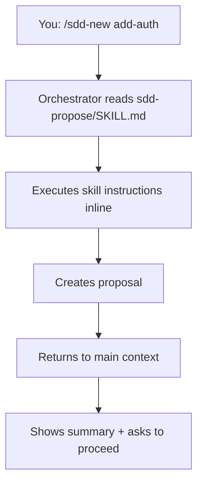

Gemini CLI runs skills inline within a single context window. While it doesn't support true sub-agent delegation, the structured SDD workflow still provides significant value for planning and implementation.

## Prerequisites

- Gemini CLI installed and configured
- Git installed for cloning the repository
- Access to `~/.gemini/` directory
- `GEMINI_SYSTEM_MD=1` environment variable set

## Installation Steps

<Steps>
  <Step title="Clone the repository">
    ```bash
    git clone https://github.com/gentleman-programming/agent-teams-lite.git
    cd agent-teams-lite
    ```
  </Step>
  
  <Step title="Run the installer">
    <CodeGroup>
    ```bash Interactive
    ./scripts/install.sh
    # Choose option 3: Gemini CLI
    ```
    
    ```bash Non-Interactive
    ./scripts/install.sh --agent gemini-cli
    ```
    </CodeGroup>
    
    This copies skills to `~/.gemini/skills/sdd-*/`
    
    You should see output like:
    ```
    Installing skills for Gemini CLI...
      ✓ _shared (3 convention files)
      ✓ sdd-init
      ✓ sdd-explore
      ✓ sdd-propose
      ✓ sdd-spec
      ✓ sdd-design
      ✓ sdd-tasks
      ✓ sdd-apply
      ✓ sdd-verify
      ✓ sdd-archive

      9 skills installed → ~/.gemini/skills
    ```
  </Step>
  
  <Step title="Configure system prompt">
    Gemini CLI requires the system prompt to be enabled via environment variable.
    
    Add to your shell profile (`~/.bashrc`, `~/.zshrc`, etc.):
    ```bash
    export GEMINI_SYSTEM_MD=1
    ```
    
    Apply changes:
    ```bash
    source ~/.bashrc  # or ~/.zshrc
    ```
  </Step>
  
  <Step title="Add orchestrator to GEMINI.md">
    Open or create the Gemini system prompt file:
    ```bash
    code ~/.gemini/GEMINI.md
    ```
    
    <Info>
      If the file doesn't exist, create it. This file contains system-level instructions for Gemini CLI.
    </Info>
    
    Append the contents from `examples/gemini-cli/GEMINI.md` to your existing file.
    
    <Accordion title="View orchestrator instructions">
    The orchestrator section teaches Gemini CLI to:
    - Detect SDD triggers and commands
    - Read skill files from `~/.gemini/skills/sdd-*/SKILL.md`
    - Execute skills inline (within current context)
    - Track state between phases
    - Follow artifact storage policies
    
    Key sections added:
    - Operating Mode (delegate-only principle)
    - Artifact Store Policy
    - Commands table
    - Command → Skill Mapping
    - Engram Artifact Convention
    </Accordion>
  </Step>
  
  <Step title="Verify installation">
    Start Gemini CLI in any project:
    ```bash
    gemini
    ```
    
    Type:
    ```
    /sdd-init
    ```
    
    Expected response:
    ```
    Reading sdd-init skill from ~/.gemini/skills/sdd-init/SKILL.md...
    
    ✓ Detected stack: [your project's stack]
    ✓ Project: [project-name]
    ✓ SDD initialized
    ```
  </Step>
</Steps>

## Configuration Locations

<CardGroup cols={2}>
  <Card title="Skills Directory" icon="folder">
    `~/.gemini/skills/sdd-*/`
    
    Contains 9 skill folders + `_shared/` conventions
  </Card>
  
  <Card title="System Prompt" icon="file">
    `~/.gemini/GEMINI.md`
    
    Orchestrator instructions and system configuration
  </Card>
  
  <Card title="Environment" icon="gear">
    `~/.gemini/.env`
    
    Must contain `GEMINI_SYSTEM_MD=1`
  </Card>
</CardGroup>

## How Inline Execution Works

Unlike Claude Code or OpenCode, Gemini CLI doesn't have a Task tool for sub-agent delegation. Instead:



**Key differences:**
- Skills run in the same context window as the orchestrator
- No fresh context per phase (more context usage)
- Still provides structured workflow and artifact management
- Planning phases work well; implementation may hit context limits on large features

## Example Usage

### Initialize SDD

```
You: /sdd-init

Gemini: Reading sdd-init skill...
        
        Detecting project stack...
        ✓ Framework: Express.js
        ✓ Language: TypeScript
        ✓ Database: PostgreSQL + TypeORM
        
        Checking for Engram MCP server...
        ✓ Engram detected
        
        Artifact store: engram
        SDD initialized for project: my-api
```

### Start a New Feature

```
You: /sdd-new add-rate-limiting

Gemini: Reading sdd-explore skill...
        
        Analyzing codebase for existing rate limiting...
        ✓ No rate limiting middleware detected
        ✓ Express middleware stack found in app.ts
        ✓ Redis client available (for distributed rate limiting)
        
        Reading sdd-propose skill...
        
        Creating proposal for: add-rate-limiting
        
        Proposal Summary:
        - Intent: Add API rate limiting with Redis backend
        - Scope: Rate limiter middleware, Redis integration, per-endpoint config
        - Approach: express-rate-limit + rate-limit-redis
        - Rollback: Remove middleware, keep Redis (used elsewhere)
        
        Artifact stored: sdd/add-rate-limiting/proposal
        
        Ready to continue with specs and design?
```

### Fast-Forward Planning

```
You: /sdd-ff add-rate-limiting

Gemini: Fast-forwarding through planning phases...
        
        [1/4] Creating specifications...
        ✓ Requirements: 4 (SHALL enforce limits, SHALL use Redis, etc.)
        ✓ Scenarios: 9 (normal request, rate limit exceeded, etc.)
        ✓ Stored: sdd/add-rate-limiting/spec
        
        [2/4] Creating technical design...
        ✓ Middleware architecture
        ✓ Redis key structure: ratelimit:{ip}:{endpoint}
        ✓ Configuration: per-route limits in config.ts
        ✓ Stored: sdd/add-rate-limiting/design
        
        [3/4] Breaking down into tasks...
        ✓ Phase 1: Redis setup (2 tasks)
        ✓ Phase 2: Middleware implementation (3 tasks)
        ✓ Phase 3: Per-route configuration (2 tasks)
        ✓ Stored: sdd/add-rate-limiting/tasks
        
        All planning complete (7 tasks total).
        Run /sdd-apply to implement.
```

## Artifact Storage

<Tabs>
  <Tab title="engram (Recommended)">
    ```bash
    # Auto-detected if Engram MCP server is available
    ```
    
    Gemini CLI can use Engram's `mem_observe` tool if the MCP server is installed and running.
    
    **Storage format:**
    ```
    title:     sdd/add-rate-limiting/proposal
    topic_key: sdd/add-rate-limiting/proposal
    type:      architecture
    project:   my-api
    ```
    
    **Recovery:**
    ```
    1. mem_search(query: "sdd/add-rate-limiting/proposal", project: "my-api")
    2. mem_get_observation(id)
    ```
  </Tab>
  
  <Tab title="openspec">
    ```bash
    # Only when you explicitly request file artifacts
    ```
    
    Creates file-based artifacts in your project:
    ```
    openspec/
    ├── config.yaml
    ├── specs/
    └── changes/
        └── add-rate-limiting/
            ├── proposal.md
            ├── specs/
            ├── design.md
            └── tasks.md
    ```
  </Tab>
  
  <Tab title="none">
    ```bash
    # Ephemeral mode - default fallback
    ```
    
    Results returned inline. No persistence.
    
    Good for:
    - Quick exploration
    - Privacy-sensitive environments
    - When you don't need artifact history
  </Tab>
</Tabs>

## System Prompt Setup

Gemini CLI requires the system prompt to be explicitly enabled:

### Option 1: Environment Variable (Global)

Add to shell profile:
```bash
# ~/.bashrc or ~/.zshrc
export GEMINI_SYSTEM_MD=1
```

### Option 2: .env File (Per-Session)

Create or edit `~/.gemini/.env`:
```bash
GEMINI_SYSTEM_MD=1
```

### Verify System Prompt is Loaded

```bash
gemini
# In Gemini prompt:
What system instructions do you have about SDD?
```

If loaded correctly, Gemini should reference the orchestrator instructions from `GEMINI.md`.

## Verification Checklist

<Steps>
  <Step title="Check skills are installed">
    ```bash
    ls ~/.gemini/skills/sdd-*/
    ```
    
    Should show 9 directories:
    ```
    sdd-apply/  sdd-design/  sdd-init/  sdd-spec/
    sdd-archive/  sdd-explore/  sdd-propose/  sdd-tasks/  sdd-verify/
    ```
  </Step>
  
  <Step title="Check shared conventions">
    ```bash
    ls ~/.gemini/skills/_shared/
    ```
    
    Should show:
    ```
    engram-convention.md
    openspec-convention.md
    persistence-contract.md
    ```
  </Step>
  
  <Step title="Verify GEMINI.md exists">
    ```bash
    cat ~/.gemini/GEMINI.md | grep -i "sdd"
    ```
    
    Should return matches if orchestrator instructions are present.
  </Step>
  
  <Step title="Check environment variable">
    ```bash
    echo $GEMINI_SYSTEM_MD
    ```
    
    Should output: `1`
  </Step>
  
  <Step title="Test SDD command">
    ```bash
    gemini
    # In Gemini prompt:
    # /sdd-init
    ```
    
    Should recognize the command and read the sdd-init skill.
  </Step>
</Steps>

## Troubleshooting

<AccordionGroup>
  <Accordion title="Command not recognized">
    **Problem:** Gemini doesn't recognize `/sdd-init`
    
    **Solutions:**
    1. Check `GEMINI_SYSTEM_MD=1` is set: `echo $GEMINI_SYSTEM_MD`
    2. Verify `~/.gemini/GEMINI.md` contains SDD orchestrator instructions
    3. Restart terminal session to reload environment variables
    4. Try alternative phrasing: "Initialize SDD for this project"
  </Accordion>
  
  <Accordion title="Skills not found">
    **Problem:** Gemini can't read skill files
    
    **Solutions:**
    1. Verify skills are in `~/.gemini/skills/sdd-*/`
    2. Check file permissions allow reading
    3. Ensure each skill has `SKILL.md` file
    4. Try absolute path in orchestrator instructions
  </Accordion>
  
  <Accordion title="System prompt not loading">
    **Problem:** Orchestrator instructions not active
    
    **Solutions:**
    1. Set environment variable: `export GEMINI_SYSTEM_MD=1`
    2. Add to shell profile for persistence
    3. Verify `~/.gemini/GEMINI.md` exists and is readable
    4. Restart Gemini CLI after making changes
  </Accordion>
  
  <Accordion title="Context window issues">
    **Problem:** Errors about context length on large features
    
    **Solutions:**
    1. Use `/sdd-explore` first to understand scope before committing
    2. Break large features into smaller changes
    3. Use `none` artifact mode to reduce context usage
    4. Consider using Claude Code or OpenCode for large features (true sub-agents)
  </Accordion>
</AccordionGroup>

## Limitations vs Claude Code/OpenCode

| Feature | Gemini CLI | Claude Code / OpenCode |
|---------|------------|------------------------|
| Sub-agent delegation | ❌ Inline execution | ✅ Fresh context per phase |
| Context isolation | ❌ Shared context | ✅ Isolated per sub-agent |
| Large feature support | ⚠️ Context limits | ✅ Scales better |
| Setup complexity | ✅ Simple | ⚠️ Requires Task tool |
| Planning phases | ✅ Works well | ✅ Works well |
| Implementation | ⚠️ May hit limits | ✅ Batched execution |

<Info>
  For the best sub-agent experience with fresh context windows, consider using [Claude Code](/installation/claude-code) or [OpenCode](/installation/opencode).
</Info>

## Next Steps

<CardGroup cols={2}>
  <Card title="Quick Start" icon="rocket" href="/quickstart">
    Learn the SDD workflow
  </Card>
  
  <Card title="Commands Reference" icon="book" href="/commands/overview">
    Complete command documentation
  </Card>
  
  <Card title="Engram Setup" icon="database" href="/guides/persistence">
    Install recommended persistence
  </Card>
  
  <Card title="Upgrade to OpenCode" icon="arrow-up" href="/installation/opencode">
    Get true sub-agent support
  </Card>
</CardGroup>