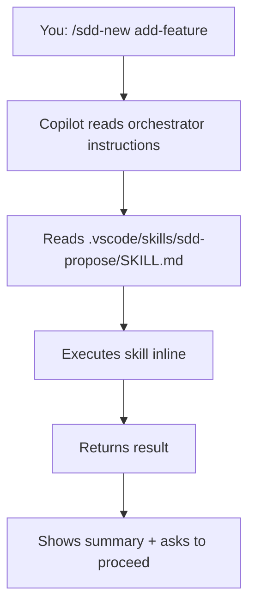

VS Code supports Agent Teams Lite through GitHub Copilot's agent mode and custom instructions. Skills work as context files, and Copilot can read and execute them inline.

## Prerequisites

- VS Code installed
- GitHub Copilot subscription and extension installed
- Git installed for cloning the repository
- Project directory to work in

## Installation Steps

<Steps>
  <Step title="Clone the repository">
    ```bash
    git clone https://github.com/gentleman-programming/agent-teams-lite.git
    cd agent-teams-lite
    ```
  </Step>
  
  <Step title="Run the installer">
    <CodeGroup>
    ```bash Interactive
    ./scripts/install.sh
    # Choose option 5: VS Code
    ```
    
    ```bash Non-Interactive
    ./scripts/install.sh --agent vscode
    ```
    </CodeGroup>
    
    This copies skills to `./.vscode/skills/sdd-*/` in the current directory.
    
    <Warning>
      VS Code installation is **project-local** by default. Skills go in `.vscode/skills/` within your project, not in a global directory.
    </Warning>
    
    You should see output like:
    ```
    Installing skills for VS Code (Copilot)...
      ✓ _shared (3 convention files)
      ✓ sdd-init
      ✓ sdd-explore
      ✓ sdd-propose
      ✓ sdd-spec
      ✓ sdd-design
      ✓ sdd-tasks
      ✓ sdd-apply
      ✓ sdd-verify
      ✓ sdd-archive

      9 skills installed → ./.vscode/skills
      
      Note: Skills installed in current project (.vscode/skills/)
    ```
  </Step>
  
  <Step title="Add orchestrator instructions">
    VS Code Copilot supports custom instructions through multiple methods. Choose one:
    
    ### Option 1: User Prompts (Recommended)
    
    Create a prompt file in your VS Code User directory:
    
    <CodeGroup>
    ```bash macOS
    mkdir -p ~/Library/Application\ Support/Code/User/prompts
    cp examples/vscode/copilot-instructions.md \
       ~/Library/Application\ Support/Code/User/prompts/sdd-orchestrator.instructions.md
    ```
    
    ```bash Linux
    mkdir -p ~/.config/Code/User/prompts
    cp examples/vscode/copilot-instructions.md \
       ~/.config/Code/User/prompts/sdd-orchestrator.instructions.md
    ```
    
    ```bash Windows
    mkdir %APPDATA%\Code\User\prompts
    copy examples\vscode\copilot-instructions.md \
         %APPDATA%\Code\User\prompts\sdd-orchestrator.instructions.md
    ```
    </CodeGroup>
    
    ### Option 2: Copilot Settings
    
    1. Open VS Code Settings (`Cmd+,` / `Ctrl+,`)
    2. Search for `github.copilot.chat.codeGeneration.instructions`
    3. Click "Edit in settings.json"
    4. Add the SDD orchestrator instructions
    
    <Accordion title="View settings.json format">
    ```json
    {
      "github.copilot.chat.codeGeneration.instructions": [
        {
          "text": "[Paste orchestrator instructions from examples/vscode/copilot-instructions.md]"
        }
      ]
    }
    ```
    </Accordion>
    
    ### Option 3: Project-Level Instructions
    
    Create `.github/copilot-instructions.md` in your project root:
    
    ```bash
    mkdir -p .github
    cp examples/vscode/copilot-instructions.md .github/copilot-instructions.md
    ```
  </Step>
  
  <Step title="Verify installation">
    Open VS Code in your project:
    ```bash
    code .
    ```
    
    Open the Chat panel (`Ctrl+Cmd+I` / `Ctrl+Alt+I`)
    
    Type:
    ```
    /sdd-init
    ```
    
    Expected response:
    ```
    Reading skill from .vscode/skills/sdd-init/SKILL.md...
    
    ✓ Detected stack: [your project's stack]
    ✓ SDD initialized
    ```
  </Step>
</Steps>

## Configuration Locations

<Tabs>
  <Tab title="Project-Local (Recommended)">
    **Skills:**
    ```
    .vscode/skills/sdd-*/
    ```
    
    **Instructions:**
    ```
    .github/copilot-instructions.md
    ```
    
    Benefits:
    - Skills committed with project
    - Team members get SDD automatically
    - Project-specific configuration
  </Tab>
  
  <Tab title="User-Level">
    **User Prompts (macOS):**
    ```
    ~/Library/Application Support/Code/User/prompts/
    ```
    
    **User Prompts (Linux):**
    ```
    ~/.config/Code/User/prompts/
    ```
    
    **User Prompts (Windows):**
    ```
    %APPDATA%\Code\User\prompts\
    ```
    
    Benefits:
    - Available across all projects
    - User-specific configuration
  </Tab>
  
  <Tab title="Settings">
    **Copilot Settings:**
    ```
    github.copilot.chat.codeGeneration.instructions
    ```
    
    Access via VS Code Settings UI or `settings.json`
    
    Benefits:
    - Centralized configuration
    - Easy to edit in VS Code
  </Tab>
</Tabs>

## MCP Server Configuration (Optional)

If you want to use Engram or other MCP servers with VS Code:

### User-Level MCP Config

<CodeGroup>
```json macOS
// ~/Library/Application Support/Code/User/mcp.json
{
  "mcpServers": {
    "engram": {
      "command": "npx",
      "args": ["-y", "@gentleman-programming/engram"]
    }
  }
}
```

```json Linux
// ~/.config/Code/User/mcp.json
{
  "mcpServers": {
    "engram": {
      "command": "npx",
      "args": ["-y", "@gentleman-programming/engram"]
    }
  }
}
```

```json Windows
// %APPDATA%\Code\User\mcp.json
{
  "mcpServers": {
    "engram": {
      "command": "npx",
      "args": ["-y", "@gentleman-programming/engram"]
    }
  }
}
```
</CodeGroup>

### Project-Level MCP Config

```json
// .vscode/mcp.json
{
  "mcpServers": {
    "engram": {
      "command": "npx",
      "args": ["-y", "@gentleman-programming/engram"]
    }
  }
}
```

## How It Works

VS Code Copilot runs skills inline as context files:



**Key characteristics:**
- Skills work as context files (not true sub-agents)
- Execution happens inline within Copilot's context
- Agent mode provides tool use capability
- Planning phases work well
- Implementation guided by skill instructions

## Example Usage

### Initialize SDD

```
You: /sdd-init

Copilot: Reading .vscode/skills/sdd-init/SKILL.md...
         
         Analyzing project structure...
         ✓ Detected: React + TypeScript + Vite
         ✓ Package manager: npm
         ✓ Testing: Vitest + React Testing Library
         
         Checking for Engram MCP server...
         ✓ Engram available
         
         SDD initialized for project: my-react-app
         Artifact store: engram
```

### Start a New Feature

```
You: /sdd-new add-search

Copilot: Exploring codebase for search functionality...
         
         ✓ No existing search implementation
         ✓ Component structure: src/components/
         ✓ API client: src/api/client.ts
         
         Creating proposal...
         
         Proposal Summary:
         - Intent: Add search functionality with filters and sorting
         - Scope: Search component, API integration, URL state sync
         - Approach: Debounced input, query params, server-side search
         - Rollback: Remove SearchBar component, remove /search route
         
         Artifact stored: sdd/add-search/proposal
         
         Ready to continue with specs and design?
```

### Continue Through Planning

```
You: Yes, continue

Copilot: Creating specifications...
         
         ✓ 4 requirements (SHALL statements)
         ✓ 8 scenarios (Given/When/Then format)
         ✓ Stored: sdd/add-search/spec
         
         Creating technical design...
         
         ✓ Component hierarchy: SearchBar -> SearchResults
         ✓ State management: URL search params + useSearchParams
         ✓ API endpoint: GET /api/search?q=...
         ✓ Debounce: 300ms using useDebouncedValue hook
         ✓ Stored: sdd/add-search/design
         
         Creating task breakdown...
         
         ✓ Phase 1: API integration (2 tasks)
         ✓ Phase 2: Search UI (3 tasks)
         ✓ Phase 3: URL sync (2 tasks)
         ✓ Total: 7 tasks
         ✓ Stored: sdd/add-search/tasks
         
         Ready to implement. Run /sdd-apply to start.
```

## Artifact Storage

<Tabs>
  <Tab title="engram (Recommended)">
    If you configure Engram MCP server, artifacts are stored persistently:
    
    ```
    title:     sdd/add-search/proposal
    topic_key: sdd/add-search/proposal
    type:      architecture
    project:   my-react-app
    ```
    
    Benefits:
    - Repository stays clean
    - Persistent across sessions
    - Searchable via mem_search
  </Tab>
  
  <Tab title="openspec">
    File-based artifacts in your project:
    
    ```
    openspec/
    ├── config.yaml
    ├── specs/
    └── changes/
        └── add-search/
            ├── proposal.md
            ├── specs/
            ├── design.md
            └── tasks.md
    ```
  </Tab>
  
  <Tab title="none">
    No persistence. Results shown inline only.
    
    Good for:
    - Quick exploration
    - Privacy-sensitive projects
    - When you don't need history
  </Tab>
</Tabs>

## Verification Checklist

<Steps>
  <Step title="Check skills in project">
    ```bash
    ls .vscode/skills/sdd-*/
    ```
    
    Should show 9 directories:
    ```
    sdd-apply/  sdd-design/  sdd-init/  sdd-spec/
    sdd-archive/  sdd-explore/  sdd-propose/  sdd-tasks/  sdd-verify/
    ```
  </Step>
  
  <Step title="Check shared conventions">
    ```bash
    ls .vscode/skills/_shared/
    ```
    
    Should show:
    ```
    engram-convention.md
    openspec-convention.md
    persistence-contract.md
    ```
  </Step>
  
  <Step title="Verify instructions are configured">
    Check one of:
    - User prompts directory has `sdd-orchestrator.instructions.md`
    - `.github/copilot-instructions.md` exists in project
    - `github.copilot.chat.codeGeneration.instructions` is set in settings
  </Step>
  
  <Step title="Test in VS Code">
    ```bash
    code .
    # Open Chat (Ctrl+Cmd+I / Ctrl+Alt+I)
    # Type: /sdd-init
    ```
    
    Should recognize the command and read the skill.
  </Step>
</Steps>

## Troubleshooting

<AccordionGroup>
  <Accordion title="Command not recognized">
    **Problem:** Copilot doesn't recognize `/sdd-init`
    
    **Solutions:**
    1. Verify orchestrator instructions are configured (check one of the three locations)
    2. Restart VS Code to reload configuration
    3. Check Copilot is enabled and logged in
    4. Try alternative phrasing: "Initialize SDD for this project"
  </Accordion>
  
  <Accordion title="Skills not found">
    **Problem:** Copilot can't read skill files
    
    **Solutions:**
    1. Verify skills are in `.vscode/skills/sdd-*/`
    2. Ensure you're in the project directory where you ran the installer
    3. Check file permissions
    4. Open the folder in VS Code (not just individual files)
  </Accordion>
  
  <Accordion title="Instructions not loading">
    **Problem:** Orchestrator behavior not active
    
    **Solutions:**
    1. Check all three instruction locations (User prompts, settings, .github/)
    2. Verify file format (must be valid Markdown)
    3. Restart VS Code after adding instructions
    4. Check Copilot settings are not disabled for workspace
  </Accordion>
  
  <Accordion title="MCP server not connecting">
    **Problem:** Engram or other MCP servers not available
    
    **Solutions:**
    1. Check `mcp.json` is in correct location (User or workspace)
    2. Verify MCP server is installed: `npx -y @gentleman-programming/engram --version`
    3. Check VS Code has MCP support enabled
    4. Review VS Code output panel for MCP errors
  </Accordion>
</AccordionGroup>

## Team Setup

To share SDD with your team:

<Steps>
  <Step title="Commit skills to repository">
    ```bash
    git add .vscode/skills/
    git add .github/copilot-instructions.md
    git commit -m "Add Agent Teams Lite SDD workflow"
    git push
    ```
  </Step>
  
  <Step title="Document in README">
    Add to your project's README:
    
    ```markdown
    ## Development Workflow
    
    This project uses Spec-Driven Development (SDD) via Agent Teams Lite.
    
    To start a new feature:
    1. Open VS Code Chat (Ctrl+Cmd+I)
    2. Run `/sdd-new <feature-name>`
    3. Follow the guided workflow
    
    See `.vscode/skills/` for available SDD commands.
    ```
  </Step>
  
  <Step title="Team members pull changes">
    Team members get SDD automatically when they pull:
    ```bash
    git pull
    code .
    # SDD is now available
    ```
  </Step>
</Steps>

## Next Steps

<CardGroup cols={2}>
  <Card title="Quick Start" icon="rocket" href="/quickstart">
    Learn the SDD workflow
  </Card>
  
  <Card title="Commands Reference" icon="book" href="/commands/overview">
    Complete command documentation
  </Card>
  
  <Card title="Engram MCP Setup" icon="database" href="/guides/persistence">
    Set up persistent storage
  </Card>
  
  <Card title="Team Workflows" icon="users" href="/guides/workflow">
    Share SDD with your team
  </Card>
</CardGroup>